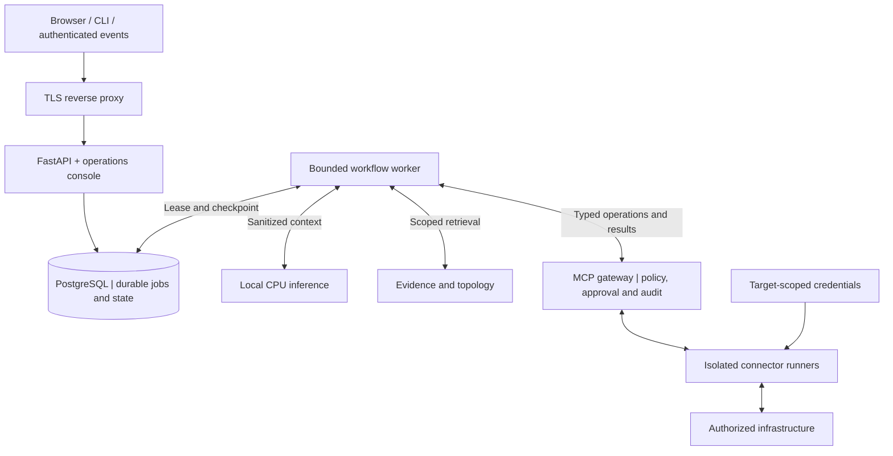

# NextOps

### CPU-only AI for evidence-grounded IT operations

[فارسی](README_FA.md) · [Release status](docs/status/current-release.yaml) · [Status brief](docs/en/PROJECT_STATUS_BRIEF.md) · [Documentation](docs/en/INDEX.md) · [G10 server plan](docs/en/SERVER_PLAN.md) · [Diagrams](docs/en/DIAGRAMS.md) · [Tech stack](docs/en/TECH_STACK.md) · [Architecture](docs/en/ARCHITECTURE.md) · [Roadmap](docs/en/ROADMAP.md) · [Project state](docs/PROJECT_STATE.md)

> **Status: controlled bilingual user testing is live across four Ubuntu 24.04 guests; production is not accepted.** Application, AI API and connector release `nextops-0.1.0-cdde129` serves local CPU answers and bounded, audited Zabbix/Linux investigations for four approved targets. Live API, fresh WAN-denied browser, service restart, rollback, serial VM reboot and dependency-recovery checks pass. The historical four-guest WAN-denial test used a temporary egress policy; host-wide public IPv4 is currently reachable, while app/AI/model units are loopback-restricted and the connector process is limited to the approved LAN. Independent backup/PITR and isolated restore, certificate rotation and operator notification, project licensing, release-integrity approval and final human sign-off remain open. See the [release status](docs/status/current-release.yaml), [current project state](docs/PROJECT_STATE.md) and [production blocker runbook](docs/en/PRODUCTION_BLOCKERS_RUNBOOK.md).

## What NextOps is intended to do

NextOps is a proposed bilingual IT operations platform for investigating infrastructure incidents, correlating monitoring evidence, and recommending safe next steps. A later, separately approved phase introduces tightly controlled remediation. Persian and English are first-class product and documentation languages.

Phase 1 delivered **a new Persian/English question → authorized read-only Zabbix data → a locally generated, evidence-linked status answer → an audit record, with Internet blocked**. Phase 2 now enriches that path with bounded direct Linux diagnostics for four approved targets. Eleven integration families remain in the roadmap; none is advertised as working before its tests and capability record exist.

## Deployment constraints

| Requirement | Project baseline |
|---|---|
| Repository | GitHub monorepo |
| Initial host | One existing G10 running ESXi 8.0.3 build 24414501 according to owner-supplied output; current free CPU/RAM and contention remain unverified |
| Reported resources | 4 CPU packages, 112 physical cores, 224 logical threads, 4 NUMA nodes; 1,442,743,631,872 bytes RAM (1,343.66 GiB); supplied VMFS figures are point-in-time capacity, not storage-health evidence |
| AI execution | Local CPUs only; no GPU, external inference, or cloud fallback |
| Offline operation | No Internet dependency after provisioning, including fresh login and cold start; authorized management-LAN access remains necessary for live evidence |
| Languages | Native Persian with RTL support; English with LTR support |
| Safety | Read-only first; deterministic authorization; exact-action approval for later mutations |

The owner's ESXi output replaces the earlier approximately 90 CPU / 1 TB estimate; see the [sanitized evidence record](docs/requirements/HARDWARE_BASELINE.json). These are reported host totals, not a direct inspection or available-capacity measurement. The average is 28 cores per NUMA node, but actual per-node CPU/memory distribution is not yet verified. Preserve ESXi; Ubuntu is the proposed guest OS, and application containers/systemd services belong inside the VMs.

**Proposed VM plan:** three NextOps VMs for Phase 1–2, plus the dedicated Zabbix prerequisite when no suitable authorized instance exists; later profiles add database separation and controlled remediation. Do not duplicate an existing suitable Zabbix. The initial four-VM proposal is **40 vCPU, 184 GiB RAM, and 980 GiB disk**, including a **24-vCPU / 128-GiB AI VM** for a topology-aware benchmark baseline. This is not a measured minimum, confirmed single-node placement or capacity guarantee. See the [per-phase allocations and Zabbix acceptance gates](docs/en/SERVER_PLAN.md) and the [mandatory offline contract](docs/en/OFFLINE_RUNTIME.md).

## Proposed architecture



**The model proposes. Application policy authorizes. The execution boundary holds device credentials.** A single host remains one failure domain; containers do not provide host-level high availability.

The [diagram atlas](docs/en/DIAGRAMS.md) expands this overview into seven views: system context, G10 deployment zones, read-only investigation, future remediation approvals, data relationships, CPU scheduling, and release delivery. All views are proposed; the MVP keeps mutations disabled. The [server plan](docs/en/SERVER_PLAN.md) supplies the current phase-specific VM placement; the earlier Linux/Zabbix combined investigation is now the Phase 2 expansion.

## Suggested technology stack

These are implementation recommendations, not installed packages or measured results. See the [full stack guide](docs/en/TECH_STACK.md) for ownership, alternatives, official references and adoption gates. The latest server evidence takes precedence over older generic host assumptions: retain ESXi and evaluate Ubuntu 24.04 LTS as the guest OS.

| Layer | Recommended starting point |
|---|---|
| Operational frontend | React · TypeScript · Vite |
| Design system and languages | Tailwind CSS · shadcn/ui · react-i18next |
| API and contracts | Python · FastAPI · Pydantic · Uvicorn |
| Data and migrations | PostgreSQL · SQLAlchemy · Alembic |
| Durable work and tools | Bounded Python worker · PostgreSQL jobs · official MCP Python SDK |
| CPU inference | One pinned local llama.cpp service; benchmark models before selection |
| Delivery and quality | Nginx · Docker Compose / systemd inside guests · uv · Ruff · mypy · pytest · Playwright |

**Add only when needed:** pgvector for evaluated semantic retrieval; TanStack Query for frontend server state; React Flow for a bounded topology view; Prometheus/Grafana and OpenTelemetry for local observability. Redis, Kubernetes and additional workflow engines are not initial requirements. No external AI provider is enabled.

## Planned integrations

Linux · Windows · Cisco IOS/IOS-XE · Juniper Junos · FortiGate · Sophos · Zabbix · Grafana · SQL Server · MySQL/MariaDB · VMware ESXi.

See the [integration contracts and status](docs/en/INTEGRATIONS.md). Vendor versions, licensing constraints, permissions, and real-device compatibility must be verified per connector.

## Start here

```bash
git clone https://github.com/Omid-NextAI/nextops.git
cd nextops
```

Read the [documentation index](docs/en/INDEX.md), [current state](docs/PROJECT_STATE.md), and [next task](docs/NEXT_TASK.md). The [installation guide](docs/en/INSTALL.md) distinguishes the controlled user-test deployment from future production promotion. The four [package-layer scripts](deploy/installers/README.md) are real, tested, offline and guarded. Reviewed systemd profiles now cover the AI, app, connector and restricted tunnel boundaries; their live evidence is specific to the current authorized guests and does not prove another deployment.

The [engineering master prompt](docs/requirements/NEXTOPS_MASTER_PROMPT.md) is retained as supplied, without a new translation. Its original Persian appendix is historical source material. Human-facing documentation is maintained in matching English and Persian guides. The revised roadmap explicitly records the owner's later Zabbix-first milestone requirement.

## Documentation

| Topic | English | فارسی |
|---|---|---|
| Presentation-ready project status | [Status brief](docs/en/PROJECT_STATUS_BRIEF.md) | [گزارش وضعیت](docs/fa/PROJECT_STATUS_BRIEF.md) |
| G10 capacity and first Zabbix answer | [Server plan](docs/en/SERVER_PLAN.md) | [سرورها و اولین پاسخ Zabbix](docs/fa/SERVER_PLAN.md) |
| Offline operating contract | [Offline runtime](docs/en/OFFLINE_RUNTIME.md) | [الزام آفلاین](docs/fa/OFFLINE_RUNTIME.md) |
| Visual architecture | [Diagram atlas](docs/en/DIAGRAMS.md) | [نمودارهای معماری](docs/fa/DIAGRAMS.md) |
| Technology decisions | [Suggested stack](docs/en/TECH_STACK.md) | [فناوری‌های پیشنهادی](docs/fa/TECH_STACK.md) |
| System design | [Architecture](docs/en/ARCHITECTURE.md) | [معماری](docs/fa/ARCHITECTURE.md) |
| CPU inference and benchmarks | [CPU-only AI](docs/en/CPU_AI.md) | [هوش مصنوعی روی CPU](docs/fa/CPU_AI.md) |
| Stage 1B native service profile | [systemd profile](docs/en/AI_SYSTEMD.md) | [پروفایل systemd](docs/fa/AI_SYSTEMD.md) |
| Security and approvals | [Security](docs/en/SECURITY.md) | [امنیت و تأیید عملیات](docs/fa/SECURITY.md) |
| Installation and configuration | [Install](docs/en/INSTALL.md) · [Configuration](docs/en/CONFIGURATION.md) | [نصب](docs/fa/INSTALL.md) · [پیکربندی](docs/fa/CONFIGURATION.md) |
| MCP and integrations | [MCP](docs/en/MCP.md) · [Integrations](docs/en/INTEGRATIONS.md) | [پروتکل MCP](docs/fa/MCP.md) · [اتصال به سامانه‌ها](docs/fa/INTEGRATIONS.md) |
| Engineering and delivery | [Development](docs/en/DEVELOPMENT.md) · [Roadmap](docs/en/ROADMAP.md) | [توسعه](docs/fa/DEVELOPMENT.md) · [نقشهٔ راه](docs/fa/ROADMAP.md) |
| Operations and recovery | [Operations](docs/en/OPERATIONS.md) · [Troubleshooting](docs/en/TROUBLESHOOTING.md) | [بهره‌برداری](docs/fa/OPERATIONS.md) · [عیب‌یابی](docs/fa/TROUBLESHOOTING.md) |
| Data, API, and interface | [Data/API](docs/en/DATA_API.md) · [UI](docs/en/UI.md) | [داده و API](docs/fa/DATA_API.md) · [رابط کاربری](docs/fa/UI.md) |
| Test and release evidence | [Testing](docs/en/TESTING.md) | [آزمون و ارزیابی](docs/fa/TESTING.md) |

## Contributing and project governance

Read [CONTRIBUTING.md](CONTRIBUTING.md), [AGENTS.md](AGENTS.md), and [SECURITY.md](SECURITY.md). The [requirements matrix](docs/requirements/TRACEABILITY.md) tracks all 51 original sections. The [decision records](docs/adr/README.md) explain the explicit revisions.

Repository visibility is public. Do not commit credentials, production addresses or inventories, private logs, model weights, database dumps, or raw discovery output. The repository's visibility does not indicate production readiness. No software license has been selected in this documentation baseline.
