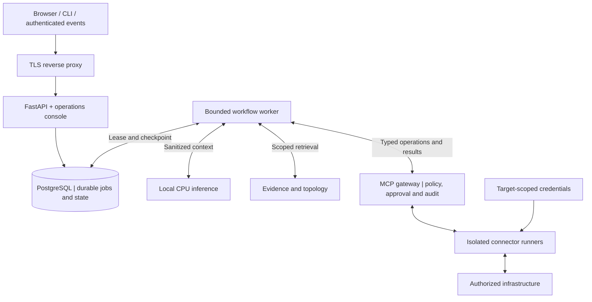

# NextOps

### CPU-only AI for evidence-grounded IT operations

[فارسی](README_FA.md) · [Documentation](docs/en/INDEX.md) · [Diagrams](docs/en/DIAGRAMS.md) · [Tech stack](docs/en/TECH_STACK.md) · [Architecture](docs/en/ARCHITECTURE.md) · [Roadmap](docs/en/ROADMAP.md) · [Project status](docs/PROJECT_STATE.md)

> **Status: documentation and architecture baseline.** The application, connectors, deployment services, and benchmarks are not implemented or validated yet. This repository does not currently provide a runnable NextOps installation.

## What NextOps is intended to do

NextOps is a proposed bilingual IT operations platform for investigating infrastructure incidents, correlating monitoring evidence, and recommending safe next steps. A later, separately approved phase introduces tightly controlled remediation. Persian and English are first-class product and documentation languages.

The first operational milestone is deliberately narrow: **a Persian request → read-only Zabbix/Linux evidence collection → an evidence-linked incident answer → an audit record**. Eleven integration families remain in the roadmap; none is advertised as working before its tests and capability record exist.

## Deployment constraints

| Requirement | Project baseline |
|---|---|
| Repository | GitHub monorepo |
| Initial host | One G10-class server; exact hardware remains unverified |
| Reported resources | Approximately 90 CPU units, 1 TB RAM, sufficient disk capacity |
| AI execution | Local CPUs only; no GPU, external inference, or cloud fallback |
| Offline operation | No Internet dependency after provisioning; authorized management-LAN access remains necessary |
| Languages | Native Persian with RTL support; English with LTR support |
| Safety | Read-only first; deterministic authorization; exact-action approval for later mutations |

“90 CPU units” is not assumed to mean 90 physical cores. Model size, thread counts, NUMA placement, and concurrency will be selected from measurements, not installed RAM capacity.

## Proposed architecture



**The model proposes. Application policy authorizes. The execution boundary holds device credentials.** A single host remains one failure domain; containers do not provide host-level high availability.

The [diagram atlas](docs/en/DIAGRAMS.md) expands this overview into seven views: system context, G10 deployment zones, read-only investigation, future remediation approvals, data relationships, CPU scheduling, and release delivery. All views are proposed; the MVP keeps mutations disabled.

## Suggested technology stack

These are implementation recommendations, not installed packages or measured results. See the [full stack guide](docs/en/TECH_STACK.md) for ownership, alternatives, official references and adoption gates.

| Layer | Recommended starting point |
|---|---|
| Operational frontend | React · TypeScript · Vite |
| Design system and languages | Tailwind CSS · shadcn/ui · react-i18next |
| API and contracts | Python · FastAPI · Pydantic · Uvicorn |
| Data and migrations | PostgreSQL · SQLAlchemy · Alembic |
| Durable work and tools | Bounded Python worker · PostgreSQL jobs · official MCP Python SDK |
| CPU inference | One pinned local llama.cpp service; benchmark models before selection |
| Delivery and quality | Nginx · Docker Compose / systemd · uv · Ruff · mypy · pytest · Playwright |

**Add only when needed:** pgvector for evaluated semantic retrieval; TanStack Query for frontend server state; React Flow for a bounded topology view; Prometheus/Grafana and OpenTelemetry for local observability. Redis, Kubernetes and additional workflow engines are not initial requirements. No external AI provider is enabled.

## Planned integrations

Linux · Windows · Cisco IOS/IOS-XE · Juniper Junos · FortiGate · Sophos · Zabbix · Grafana · SQL Server · MySQL/MariaDB · VMware ESXi.

See the [integration contracts and status](docs/en/INTEGRATIONS.md). Vendor versions, licensing constraints, permissions, and real-device compatibility must be verified per connector.

## Start here

```bash
git clone https://github.com/AmirMo10/nextops.git
cd nextops
```

Read the [documentation index](docs/en/INDEX.md), [current state](docs/PROJECT_STATE.md), and [next task](docs/NEXT_TASK.md). The [installation guide](docs/en/INSTALL.md) distinguishes today's repository setup from the future deployment procedure; there is no fabricated installer or compose command.

The [engineering master prompt](docs/requirements/NEXTOPS_MASTER_PROMPT.md) is retained as supplied, without a new translation. Its original Persian appendix is historical source material. Human-facing documentation is maintained in matching English and Persian guides.

## Documentation

| Topic | English | فارسی |
|---|---|---|
| Visual architecture | [Diagram atlas](docs/en/DIAGRAMS.md) | [نمودارهای معماری](docs/fa/DIAGRAMS.md) |
| Technology decisions | [Suggested stack](docs/en/TECH_STACK.md) | [فناوری‌های پیشنهادی](docs/fa/TECH_STACK.md) |
| System design | [Architecture](docs/en/ARCHITECTURE.md) | [معماری](docs/fa/ARCHITECTURE.md) |
| CPU inference and benchmarks | [CPU-only AI](docs/en/CPU_AI.md) | [هوش مصنوعی روی CPU](docs/fa/CPU_AI.md) |
| Security and approvals | [Security](docs/en/SECURITY.md) | [امنیت و تأیید عملیات](docs/fa/SECURITY.md) |
| Installation and configuration | [Install](docs/en/INSTALL.md) · [Configuration](docs/en/CONFIGURATION.md) | [نصب](docs/fa/INSTALL.md) · [پیکربندی](docs/fa/CONFIGURATION.md) |
| MCP and integrations | [MCP](docs/en/MCP.md) · [Integrations](docs/en/INTEGRATIONS.md) | [پروتکل MCP](docs/fa/MCP.md) · [اتصال به سامانه‌ها](docs/fa/INTEGRATIONS.md) |
| Engineering and delivery | [Development](docs/en/DEVELOPMENT.md) · [Roadmap](docs/en/ROADMAP.md) | [توسعه](docs/fa/DEVELOPMENT.md) · [نقشهٔ راه](docs/fa/ROADMAP.md) |
| Operations and recovery | [Operations](docs/en/OPERATIONS.md) · [Troubleshooting](docs/en/TROUBLESHOOTING.md) | [بهره‌برداری](docs/fa/OPERATIONS.md) · [عیب‌یابی](docs/fa/TROUBLESHOOTING.md) |
| Data, API, and interface | [Data/API](docs/en/DATA_API.md) · [UI](docs/en/UI.md) | [داده و API](docs/fa/DATA_API.md) · [رابط کاربری](docs/fa/UI.md) |
| Test and release evidence | [Testing](docs/en/TESTING.md) | [آزمون و ارزیابی](docs/fa/TESTING.md) |

## Contributing and project governance

Read [CONTRIBUTING.md](CONTRIBUTING.md), [AGENTS.md](AGENTS.md), and [SECURITY.md](SECURITY.md). The [requirements matrix](docs/requirements/TRACEABILITY.md) tracks all 51 original sections. The [decision records](docs/adr/README.md) explain the explicit revisions.

Repository visibility is public. Do not commit credentials, production addresses or inventories, private logs, model weights, database dumps, or raw discovery output. The repository's visibility does not indicate production readiness. No software license has been selected in this documentation baseline.
