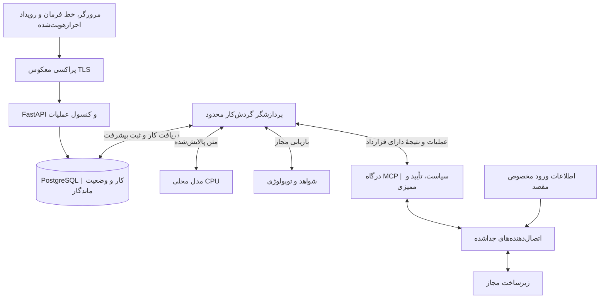

<div dir="rtl">

# نکست‌آپس | NextOps

### هوش مصنوعی مبتنی بر CPU برای پایش و عیب‌یابی مستند زیرساخت

[English](README.md) · [وضعیت انتشار](docs/status/current-release.yaml) · [گزارش وضعیت](docs/fa/PROJECT_STATUS_BRIEF.md) · [فهرست مستندات](docs/fa/INDEX.md) · [چیدمان سرورها](docs/fa/SERVER_PLAN.md) · [نمودارها](docs/fa/DIAGRAMS.md) · [فناوری‌ها](docs/fa/TECH_STACK.md) · [معماری](docs/fa/ARCHITECTURE.md) · [نقشهٔ راه](docs/fa/ROADMAP.md) · [وضعیت پروژه](docs/PROJECT_STATE.md)

> **وضعیت فعلی: مسیر دوزبانه روی چهار مهمان Ubuntu 24.04 برای آزمون کنترل‌شدهٔ کاربران زنده است؛ پذیرش تولید انجام نشده است.** انتشار `nextops-0.1.0-cdde129` برای برنامه، API هوش مصنوعی و اتصال‌دهنده، پاسخ محلی CPU و بررسی محدود و ممیزی‌شدهٔ Zabbix/Linux را برای چهار مقصد مجاز فراهم می‌کند. API زنده، مرورگر تازه با WAN مسدود، راه‌اندازی مجدد سرویس، بازگشت انتشار، reboot ترتیبی مهمان‌ها و بازیابی وابستگی‌ها آزموده شده‌اند. آزمون تاریخی منع WAN چهار مهمان سیاست خروجی موقت داشت؛ اکنون IPv4 عمومی در سطح میزبان قابل دسترسی است، هرچند واحدهای برنامه، AI و مدل به loopback محدودند. پشتیبان مستقل، PITR و restore ایزوله، چرخش گواهی و تحویل اعلان، مجوز پروژه، تأیید تمامیت انتشار و امضای نهایی مسئولان هنوز بازند. [مانیفست انتشار](docs/status/current-release.yaml)، [وضعیت جاری](docs/PROJECT_STATE.md) و [راهنمای موانع تولید](docs/fa/PRODUCTION_BLOCKERS_RUNBOOK.md) مرجع‌اند.

## NextOps قرار است چه کاری انجام دهد؟

NextOps بستری دوزبانه برای بررسی رخدادهای زیرساخت، کنار هم گذاشتن شواهد پایش و پیشنهاد گام بعدیِ ایمن است. اجرای اقدامات اصلاحی در مرحله‌ای جداگانه و پس از فراهم شدن کنترل‌های امنیتی و تأییدهای لازم اضافه خواهد شد. فارسی و انگلیسی از ابتدا جزو زبان‌های اصلی محصول و مستندات‌اند.

مرحلهٔ یک، **سؤال تازهٔ فارسی یا انگلیسی، دادهٔ فقط‌خواندنی و مجاز Zabbix، پاسخ محلی و مستند و ممیزی با اینترنت قطع** را تحویل داد. مرحلهٔ دو اکنون این مسیر را با عیب‌یابی مستقیم و محدود Linux برای چهار مقصد مصوب تکمیل می‌کند. پشتیبانی از یازده خانوادهٔ سامانه در نقشهٔ راه حفظ شده است؛ اما هیچ اتصالی پیش از آزمون و ثبت وضعیت واقعی آن، «آماده» معرفی نمی‌شود.

## محدودیت‌های استقرار

| موضوع | مبنای پروژه |
|---|---|
| مدیریت کد | یک مخزن یکپارچه در GitHub |
| میزبان اولیه | یک G10 با ESXi 8.0.3 build 24414501 طبق خروجی ارسالی مالک؛ CPU/RAM آزاد فعلی و contention هنوز بررسی نشده‌اند |
| منابع گزارش‌شده | ۴ بستهٔ پردازنده، ۱۱۲ هستهٔ فیزیکی، ۲۲۴ رشتهٔ منطقی، ۴ گرهٔ NUMA؛ حافظهٔ ۱٬۴۴۲٬۷۴۳٬۶۳۱٬۸۷۲ بایت، معادل ۱٬۳۴۳٫۶۶ GiB؛ ارقام VMFS ارسالی فقط ظرفیت لحظه‌ای‌اند و شاهد سلامت storage نیستند |
| پردازش هوش مصنوعی | فقط روی CPU محلی؛ بدون GPU، سرویس ابری یا جایگزین خودکار خارجی |
| کارکرد آفلاین | بدون وابستگی به اینترنت پس از آماده‌سازی، حتی برای ورود تازه و شروع مجدد؛ دادهٔ زنده به مسیر مجاز شبکهٔ داخلی نیاز دارد |
| زبان | فارسی راست‌به‌چپ و انگلیسی چپ‌به‌راست |
| ایمنی | شروع با عملیات فقط‌خواندنی، کنترل دسترسی قطعی و تأیید دقیق اقدامات تغییردهنده در مراحل بعد |

خروجی ESXi که مالک فرستاده، جایگزین برآورد قبلیِ حدود ۹۰ واحد CPU و یک ترابایت حافظه می‌شود؛ [رکورد پالایش‌شدهٔ شواهد](docs/requirements/HARDWARE_BASELINE.json) در مخزن است. این اعداد ظرفیت کل گزارش‌شده‌اند، نه نتیجهٔ اتصال مستقیم یا سنجش منابع آزاد. میانگین هسته در هر گرهٔ NUMA برابر ۲۸ است، اما توزیع واقعی CPU و حافظهٔ گره‌ها هنوز تأیید نشده است. ESXi حفظ می‌شود؛ Ubuntu سیستم‌عامل مهمان پیشنهادی است و کانتینرها یا سرویس‌های systemd داخل ماشین‌های مجازی اجرا می‌شوند.

**چیدمان پیشنهادی:** سه ماشین NextOps در مراحل یک و دو و، در نبود Zabbix مناسب و مجاز، سرور مستقل Zabbix به‌عنوان پیش‌نیاز؛ چیدمان‌های بعدی جداسازی پایگاه و اصلاح کنترل‌شده را اضافه می‌کنند. Zabbix مناسب موجود دوباره ساخته نشود. پیشنهاد اولیهٔ چهارماشینی **۴۰ vCPU، حافظهٔ ۱۸۴ GiB و دیسک ۹۸۰ GiB** است؛ ماشین AI با **۲۴ vCPU و ۱۲۸ GiB حافظه** مبنای شروع سنجش متناسب با توپولوژی خواهد بود. این اعداد حداقل سنجیده‌شده، تضمین جای‌گیری در یک گره یا تضمین ظرفیت نیستند. [منابع هر مرحله و معیار پذیرش Zabbix](docs/fa/SERVER_PLAN.md) و [الزام آفلاین](docs/fa/OFFLINE_RUNTIME.md) را ببینید.

## معماری پیشنهادی

کاربر از طریق رابط وب، خط فرمان یا ورودی هشدار با سامانه ارتباط می‌گیرد. API درخواست را به گردش‌کار ماندگار می‌سپارد. مدل محلی برای تحلیل از شواهد مجاز استفاده می‌کند؛ سپس لایهٔ سیاست‌گذاری دربارهٔ مجاز بودن عملیات تصمیم می‌گیرد. فقط درگاه اجرایی MCP و اتصال‌دهندهٔ مربوط، دسترسی لازم برای ارتباط با تجهیز را دریافت می‌کنند.

</div>



<div dir="rtl">

**مدل پیشنهاد می‌دهد؛ کدِ سیاست‌گذاری اجازه می‌دهد؛ لایهٔ اجرا اطلاعات ورود به تجهیزات را نگه می‌دارد.** چند کانتینر روی یک میزبان، تاب‌آوری در برابر خرابی همان میزبان ایجاد نمی‌کند.

[مجموعهٔ نمودارها](docs/fa/DIAGRAMS.md) هفت نمای تکمیلی دارد: نمای کلی، ناحیه‌های استقرار G10، بررسی فقط‌خواندنی، تأیید اصلاحات آینده، ارتباط داده‌ها، زمان‌بندی CPU و مسیر انتشار. همهٔ نماها پیشنهادی‌اند و تغییر زیرساخت در نسخهٔ اولیه غیرفعال می‌ماند. [برنامهٔ سرورها](docs/fa/SERVER_PLAN.md) چیدمان فعلی هر مرحله را مشخص می‌کند؛ بررسی ترکیبی قبلی Linux و Zabbix اکنون گسترش مرحلهٔ دو است.

## فناوری‌های پیشنهادی

این جدول پیشنهاد پیاده‌سازی است، نه فهرست بسته‌های نصب‌شده یا نتیجهٔ سنجش کارایی. مسئولیت هر ابزار، گزینه‌های جایگزین، منابع رسمی و شرط استفاده در [راهنمای فناوری‌ها](docs/fa/TECH_STACK.md) آمده است. شواهد تازهٔ میزبان بر فرض‌های عمومی قبلی مقدم‌اند: ESXi حفظ و Ubuntu 24.04 LTS به‌عنوان سیستم‌عامل مهمان بررسی شود.

| بخش | ترکیب پیشنهادی برای شروع |
|---|---|
| رابط عملیاتی | React · TypeScript · Vite |
| سیستم طراحی و زبان | Tailwind CSS · shadcn/ui · react-i18next |
| API و قرارداد | Python · FastAPI · Pydantic · Uvicorn |
| داده و مهاجرت | PostgreSQL · SQLAlchemy · Alembic |
| کار ماندگار و ابزار | پردازشگر محدود Python · صف PostgreSQL · SDK رسمی Python برای MCP |
| پردازش مدل | یک سرویس محلی llama.cpp با نسخهٔ ثابت؛ انتخاب مدل پس از سنجش |
| استقرار و کیفیت | Nginx · Docker Compose / systemd داخل مهمان‌ها · uv · Ruff · mypy · pytest · Playwright |

**هنگام نیاز اضافه شوند:** pgvector برای بازیابی معناییِ ارزیابی‌شده؛ TanStack Query برای وضعیت دادهٔ سرور در رابط؛ React Flow برای نمای محدود توپولوژی؛ Prometheus و Grafana و OpenTelemetry برای پایش محلی. Redis، Kubernetes و موتورهای گردش‌کار اضافی نیاز اولیه نیستند. ارائه‌دهندهٔ خارجی هوش مصنوعی فعال نمی‌شود.

## اتصال‌های پیش‌بینی‌شده

Linux، Windows، Cisco IOS/IOS-XE، Juniper Junos، FortiGate، Sophos، Zabbix، Grafana، SQL Server، MySQL/MariaDB و VMware ESXi.

دامنهٔ قابلیت‌ها و محدودیت‌های هرکدام در [راهنمای اتصال به سامانه‌ها](docs/fa/INTEGRATIONS.md) آمده است. نسخه، مجوز محصول، سطح دسترسی و سازگاری با تجهیز واقعی باید جداگانه بررسی شوند.

## از کجا شروع کنیم؟

ابتدا مخزن را دریافت کنید:

</div>

```bash
git clone https://github.com/Omid-NextAI/nextops.git
cd nextops
```

<div dir="rtl">

سپس [فهرست مستندات](docs/fa/INDEX.md)، [وضعیت فعلی](docs/PROJECT_STATE.md) و [کار بعدی](docs/NEXT_TASK.md) را بخوانید. [راهنمای نصب](docs/fa/INSTALL.md) استقرار کنترل‌شدهٔ ارزیابی را از ارتقای آینده به تولید جدا می‌کند. چهار [اسکریپت لایهٔ بسته‌ها](deploy/installers/README.md) واقعی، آزموده، آفلاین و محافظت‌شده‌اند. پروفایل‌های بازبینی‌شدهٔ systemd اکنون مرزهای هوش مصنوعی، برنامه، اتصال و تونل‌های محدود را پوشش می‌دهند؛ شواهد زندهٔ آن‌ها فقط برای مهمان‌های مجاز فعلی معتبر است و استقرار دیگر را ثابت نمی‌کند.

[پرامپت اصلی توسعه](docs/requirements/NEXTOPS_MASTER_PROMPT.md) بدون تهیهٔ ترجمهٔ جدید نگه داشته می‌شود. پیوست فارسی موجود در آن، متن اولیهٔ نیازمندی‌هاست. راهنماهای انسانی در دو پوشهٔ فارسی و انگلیسی به‌صورت متناظر نگهداری می‌شوند. نقشهٔ راه بازنگری‌شده، اولویت تازهٔ مالک برای پاسخ Zabbix در اولین مرحله را صریح ثبت می‌کند.

## راهنماهای اصلی

| موضوع | راهنمای فارسی | English |
|---|---|---|
| گزارش آمادهٔ ارائه از وضعیت پروژه | [گزارش وضعیت](docs/fa/PROJECT_STATUS_BRIEF.md) | [Status brief](docs/en/PROJECT_STATUS_BRIEF.md) |
| ظرفیت G10 و اولین پاسخ Zabbix | [برنامهٔ سرورها](docs/fa/SERVER_PLAN.md) | [Server plan](docs/en/SERVER_PLAN.md) |
| کارکرد بدون اینترنت | [الزام آفلاین](docs/fa/OFFLINE_RUNTIME.md) | [Offline runtime](docs/en/OFFLINE_RUNTIME.md) |
| نمایش معماری | [نمودارها](docs/fa/DIAGRAMS.md) | [Diagram atlas](docs/en/DIAGRAMS.md) |
| انتخاب فناوری | [فناوری‌های پیشنهادی](docs/fa/TECH_STACK.md) | [Suggested stack](docs/en/TECH_STACK.md) |
| طراحی سامانه | [معماری](docs/fa/ARCHITECTURE.md) | [Architecture](docs/en/ARCHITECTURE.md) |
| پردازش مدل و سنجش کارایی | [هوش مصنوعی روی CPU](docs/fa/CPU_AI.md) | [CPU-only AI](docs/en/CPU_AI.md) |
| پروفایل بومی سرویس مرحلهٔ 1B | [پروفایل systemd](docs/fa/AI_SYSTEMD.md) | [systemd profile](docs/en/AI_SYSTEMD.md) |
| امنیت و تأیید عملیات | [امنیت](docs/fa/SECURITY.md) | [Security](docs/en/SECURITY.md) |
| نصب و تنظیمات | [نصب](docs/fa/INSTALL.md) · [پیکربندی](docs/fa/CONFIGURATION.md) | [Install](docs/en/INSTALL.md) · [Configuration](docs/en/CONFIGURATION.md) |
| اتصال‌ها | [MCP](docs/fa/MCP.md) · [سامانه‌ها](docs/fa/INTEGRATIONS.md) | [MCP](docs/en/MCP.md) · [Integrations](docs/en/INTEGRATIONS.md) |
| توسعه و تحویل | [توسعه](docs/fa/DEVELOPMENT.md) · [نقشهٔ راه](docs/fa/ROADMAP.md) | [Development](docs/en/DEVELOPMENT.md) · [Roadmap](docs/en/ROADMAP.md) |
| بهره‌برداری | [عملیات و بازیابی](docs/fa/OPERATIONS.md) · [عیب‌یابی](docs/fa/TROUBLESHOOTING.md) | [Operations](docs/en/OPERATIONS.md) · [Troubleshooting](docs/en/TROUBLESHOOTING.md) |
| داده و تجربهٔ کاربری | [داده و API](docs/fa/DATA_API.md) · [رابط کاربری](docs/fa/UI.md) | [Data/API](docs/en/DATA_API.md) · [UI](docs/en/UI.md) |
| اعتبارسنجی | [آزمون و ارزیابی](docs/fa/TESTING.md) | [Testing](docs/en/TESTING.md) |

## مشارکت و وضعیت حقوقی

[راهنمای مشارکت](CONTRIBUTING.md)، [قواعد عامل توسعه](AGENTS.md) و [سیاست امنیت](SECURITY.md) را بخوانید. [ماتریس ردیابی](docs/requirements/TRACEABILITY.md) هر ۵۱ بخش مشخصات اولیه را دنبال می‌کند و [سوابق تصمیم‌های معماری](docs/adr/README.md) تغییرات صریح را توضیح می‌دهد.

مخزن عمومی است. رمز عبور، کلید دسترسی، نشانی‌ها و فهرست واقعی تجهیزات، گزارش محرمانه، فایل مدل، نسخهٔ پشتیبان پایگاه داده و خروجی خام بررسی سرور نباید در آن ثبت شوند. عمومی بودن مخزن به معنای آمادگی محصول برای بهره‌برداری نیست. مجوز نرم‌افزاری پروژه هنوز انتخاب نشده است.

</div>
