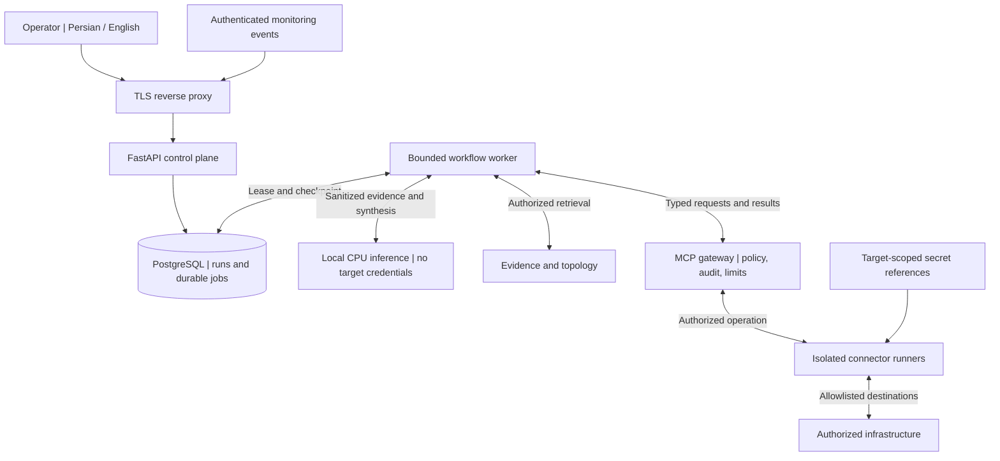
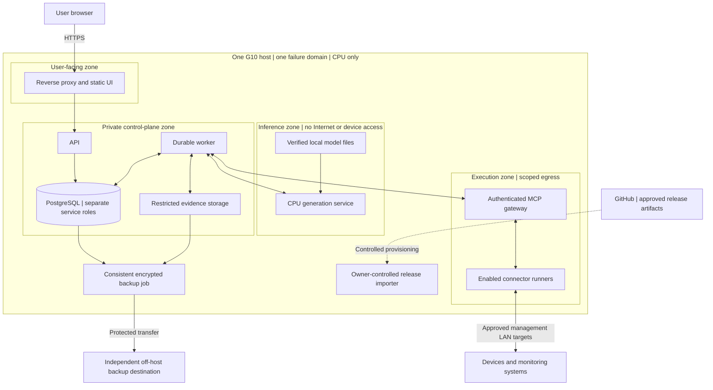
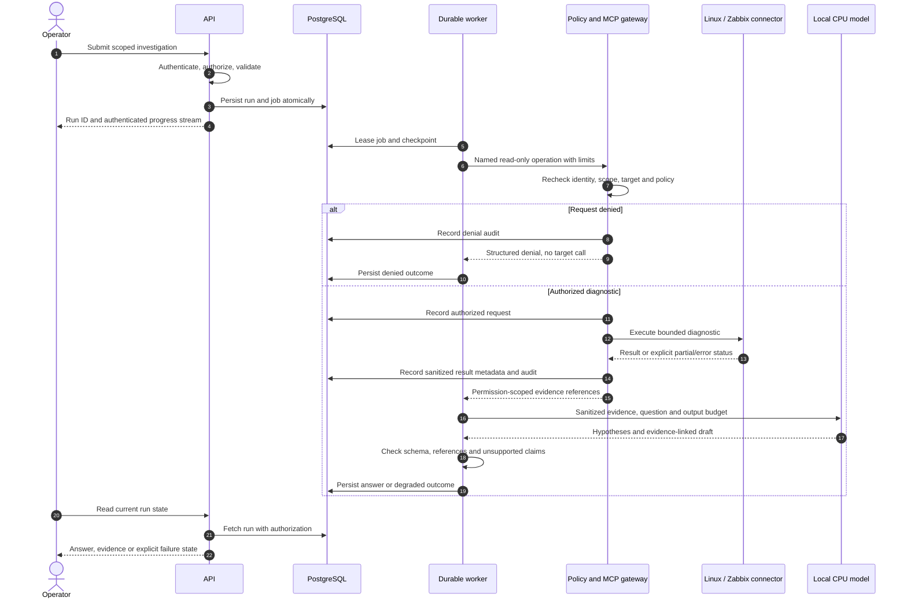
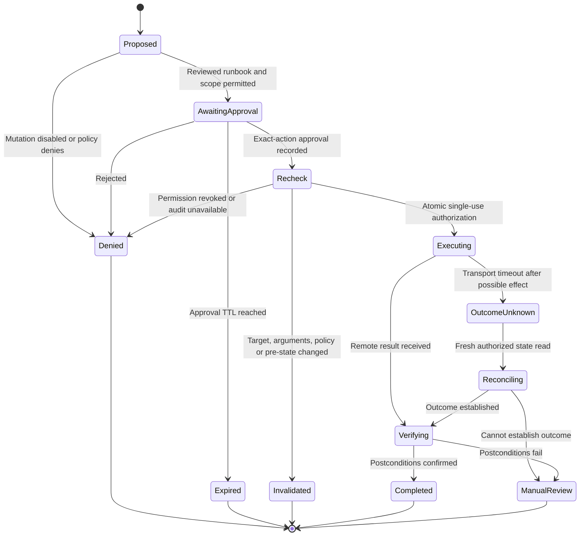
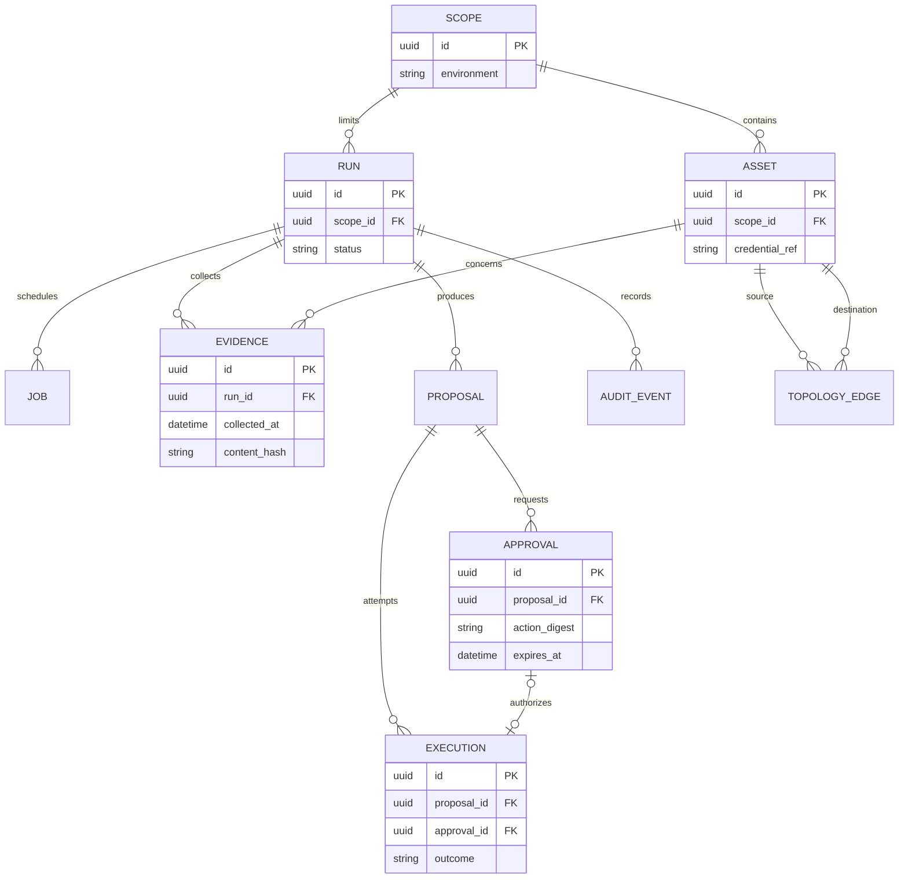
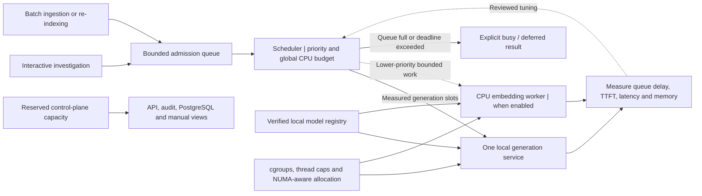

# Architecture diagram atlas

[فارسی](../fa/DIAGRAMS.md) · [Index](INDEX.md) · [Technology choices](TECH_STACK.md) · [Architecture](ARCHITECTURE.md)

> **Proposed design, not a deployed system.** These diagrams expand the [master specification](../requirements/NEXTOPS_MASTER_PROMPT.md), especially sections 5, 7–13, 16, 18 and 20–22. They do not change the prompt, authorize infrastructure access, or claim that any service exists.

Seven views explain different questions. Arrows show requests, data flow or state transitions as labeled—not blanket network permissions. Dashed links indicate controlled provisioning or optional work, not a runtime cloud dependency. Shared boxes do not imply shared credentials.

## 1. System context and trust boundaries

Who interacts with NextOps, and where may infrastructure credentials exist?

The worker requests evidence through the gateway; it does not connect directly to devices. The model receives only permitted, sanitized context. Policy is enforced again at the execution boundary. All eleven integration families fit behind the connector contract; not all run by default.

## 2. Single-host deployment and network zones

Where do the processes run, and what happens when the G10 fails?

Zones are intended restrictions, not implemented firewall rules. Compose networks alone are not a complete egress policy. Only the reverse proxy is user-facing; host administration has a separate approved path. Importing a release is not permission to run arbitrary GitHub workflows on the management host. Recovery keys need their own protected recovery process. The off-host backup destination is still unresolved; a second directory on the G10 is not disaster recovery.

## 3. First read-only investigation

How does the first useful workflow produce an evidence-linked answer?

Change approval is not needed for an authorized read, but access checks and audit still apply. Connector failures must remain visible; missing evidence is not replaced with invented measurements. Model unavailability leaves a readable run and its collected evidence, not a silently rerouted cloud request. Sequence arrows to PostgreSQL represent distinct scoped service roles, not a shared superuser.

## 4. Future remediation lifecycle

How is an exact action approved, and how are ambiguous remote outcomes handled?

**All mutation paths remain disabled in the MVP.** Approval binds the exact action, arguments, target, requester, environment, expected pre-state, policy version, expiry and single-use nonce. An uncertain outcome must never trigger a blind retry. Cancellation of local work does not prove remote cancellation. Rollback is a separately authorized operation, not an automatic transition in this diagram. This is the remediation sub-workflow, not the entire investigation state machine.

## 5. Core data relationships

What must be stored durably? This is a conceptual subset—not an implemented schema.

Execution approval is nullable for permitted reads; policy requires it for enabled mutations. A consumed approval cannot authorize another execution: enforce uniqueness and atomic transitions. Scope-safe foreign keys, role assignments, retention, audit-only administrative events, document chunks and many-to-many evidence links need the full design in [Data and API](DATA_API.md). `credential_ref` is a reference, never a plaintext credential. An asset relation is observed or inferred with provenance and freshness; it is not proof of a live network link.

## 6. CPU work admission and resource control

How can the API stay responsive while the model is busy?

The initial benchmark starts with one active generation request and increases concurrency only after measurement. The diagram is not a claim of a specific thread count, core count or tokens/second. Count prompt work, generation, embeddings, ingestion, compilation and database activity in one resource budget. Async APIs do not make CPU-heavy inference free. Neither 90 reported CPU units nor 1 TB of RAM establishes an operating capacity.

## 7. GitHub-to-server release path

How do reviewed artifacts reach the server without granting untrusted code infrastructure access?

```mermaid
flowchart LR
    C["Small source change"] --> PR["Reviewable branch / pull request"]
    PR --> CI["Isolated checks | no device credentials"]
    CI --> REV["Review and approved commit"]
    REV --> ART["Pinned build, checksums and dependency manifests"]
    ART --> LAB["Authorized staging and CPU validation"]
    LAB --> GATE["Owner release approval"]
    GATE --> PRE["Backup, migration and compatibility preflight"]
    PRE --> DEP["Controlled G10 deployment"]
    DEP --> HEALTH["Readiness and verification"]
    HEALTH -->|"Healthy"| ACCEPT["Accept release"]
    HEALTH -->|"Unhealthy"| REC["Tested rollback or recovery procedure"]
```

This is a future delivery policy, not a configured Actions workflow. Generic pull requests never run on a privileged persistent G10 runner. Hardware/lab checks are explicitly authorized and isolated. Rollback must account for schema and model compatibility; restarting an older container does not undo a database migration. Offline releases follow the same verification gates through an imported bundle.

## Editing and rendering

Keep English and Persian views equivalent. Diagram identifiers and database fields stay in English; explanations and operator-facing labels are localized. Use ordinary Mermaid `flowchart`, `sequenceDiagram`, `stateDiagram-v2` and `erDiagram` blocks. GitHub supports Mermaid in Markdown; syntax support depends on its renderer version. See [GitHub's diagram guide](https://docs.github.com/en/get-started/writing-on-github/working-with-advanced-formatting/creating-diagrams), reviewed 2026-09-20.

No external image host, embedded credential, production address or diagram-generation service is required. GitHub rendering is a documentation feature, not part of NextOps's offline runtime. Check the rendered files after changes; text/link checks are not a Mermaid rendering test. See the [review record](../VISUAL_REVIEW.md) for this change's actual validation scope.
