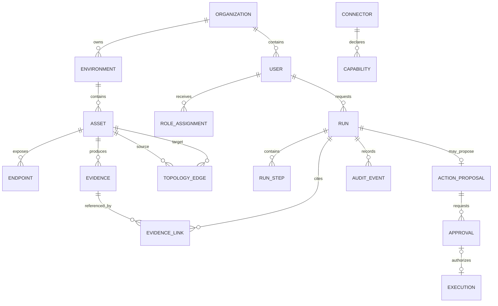

# Phase 0 architecture, gap and readiness report

[فارسی](../fa/PHASE_0_REPORT.md) · [Start here](START_HERE.md) · [Project state](../PROJECT_STATE.md) · [Next task](../NEXT_TASK.md) · [Threat model](../requirements/nextops-threat-model.md)

Status: accepted by the owner on 2026-09-21. Scope: repository and supplied-evidence review only. Acceptance is not infrastructure authorization; no VM, model, network, Zabbix, ESXi, storage, restart, or production change was performed.

Acceptance record: the owner approved the four-VM logical architecture, trust boundaries, ADRs 0001–0006, Stage 1A–1E roadmap, and the local denial-first Stage 1A contract increment. The initial deployment remains one organization at small scale, designed for measured future growth, with a dedicated Zabbix server. Provisioning, target access, and operational changes still require separate authorization.

## 1. Executive architecture recommendation

Adopt the documented modular control plane with four initial VMs on the existing ESXi host: three NextOps VMs plus a dedicated Zabbix VM. Keep one authoritative PostgreSQL service inside `nextops-app` initially, one local CPU inference service, and one protected read-only connector boundary. The first complete outcome remains a new Persian or English question answered from real, authorized Zabbix evidence by the local CPU model with Internet blocked, source time, scope, missing-data disclosure, and durable audit.

The owner confirmed these Phase 0 context assumptions:

- one organization initially, with multi-organization expansion deferred to a separately designed migration;
- a small initial workload, while retaining typed interfaces and resource controls that can grow after measurement;
- a dedicated `zabbix-server` rather than the older small lab fallback;
- internal LAN/VPN use is assumed for this report; public ingress is not approved.

The implementation order is Stage 1A `nextops-app`, then Stage 1B `nextops-ai`, then Stage 1C `nextops-connectors-ro`. Local Stage 1A code may proceed under this approval; VM preparation still requires separate authorization. The Zabbix VM may be prepared beside 1A/1B after that authorization but must be ready before live Stage 1C reads. No target credential crosses into the model or browser.

## 2. Repository findings and preserved components

Observed directly in the local checkout:

| Item | Finding |
|---|---|
| Repository | `origin` is `https://github.com/Omid-NextAI/nextops.git`; branch `main` tracks `origin/main` |
| Reviewed commit | `41508444ff0b9408154fbe1b458f7e89a5428bf9` |
| Worktree | Clean at review time |
| Tracked files | 80 |
| Implementation | Documentation-only; no backend/frontend source, manifests, lockfiles, migrations, deployment definitions, or CI workflows |
| Executable project file | `scripts/check_docs.py`, a network-free documentation validator |
| Documentation validation | PASS with `PYTHONUTF8=1`: 73 Markdown files, 23 English/Persian guide pairs, local links and RTL wrappers checked |
| Initial validation issue | The first Windows run reached PASS but exited while printing Persian through CP1252; rerunning with UTF-8 completed successfully |
| Product/runtime tests | Not available and not run because no product implementation exists |

Preserve and build on:

- the active prompt, byte-preserved v2 archive, source history, 51-section traceability, and eleven connector families;
- ADRs 0001–0006, currently proposed rather than accepted;
- paired English/Persian operational guides and the local documentation checker;
- the supplied hardware/storage record and its distinction between owner-supplied, calculated, reference-mapped, proposed, implemented, and tested evidence;
- the dedicated Zabbix deployment amendment and allocation record.

Repository gaps:

- The active prompt header still names historical `AmirMo10/nextops`, while the verified primary remote is `Omid-NextAI/nextops`. Current README/install clone commands were corrected in this Phase 0 change; historical changelog/validation statements remain historical, and the active prompt needs a separately versioned identity correction.
- `docs/en/OFFLINE_RUNTIME.md` and its Persian pair contain stale Phase-2-first-answer wording that conflicts with the active Phase 1 Zabbix-first requirement.
- `TRACEABILITY.md` still maps Zabbix primarily to Phase 2 and marks the first architecture report planned; these statuses need to reflect the Phase 0 report without claiming implementation.
- GitHub branch protection, required reviews, CI, secret scanning, private vulnerability reporting, release signing, and repository policy settings were not verified.

## 3. Verified hardware/OS facts and unresolved assumptions

The following are owner-supplied observations recorded in `HARDWARE_BASELINE.json`, not direct inspection by this review:

| Fact | Evidence status |
|---|---|
| VMware ESXi 8.0.3, build 24414501, Update 3, raw Patch 55 | Owner-supplied; build reference maps to ESXi 8.0 U3c |
| 4 CPU packages, 112 physical cores, 224 logical threads, Hyperthreading active | Owner-supplied aggregate |
| 4 NUMA nodes | Owner-supplied aggregate |
| 1,442,743,631,872 bytes RAM, about 1,343.66 GiB | Owner-supplied bytes plus calculated conversion |
| Intel family/model/stepping 6/85/7 for CPU 0 and part of CPU 1 | Partial sample; not a complete package inventory or exact marketing SKU |
| DS-C 3,576.75 GiB total and 3,166.87 GiB free | Point-in-time owner-supplied VMFS row |
| No GPU and all AI local on CPU | Owner requirement, not a device inventory result |

Do not request the aggregate host/build/datastore facts again. Still required before provisioning or runtime selection:

- current available CPU/RAM, existing VM load, reservations, CPU ready/co-stop, and actual per-node distribution;
- VM hardware compatibility level, saved virtual topology, guest-visible ISA, and compatible backup/recovery tooling;
- current DS-C free space, outstanding thin-disk commitments, ESXi swap placement, snapshot/consolidation/restore workspace, backing RAID/device health, and latency;
- approved port groups, firewall paths, local DNS/time/TLS, administrative recovery, and whether vCenter is available;
- actual Zabbix host/item/event scale, required host groups, API version/base path, retention growth, and sample questions;
- approved offline packages, images, model/runtime artifacts, licenses, checksums, and off-host backup destination;
- numeric quality, latency, concurrency, RPO/RTO, and sustained-test targets.

Ubuntu Server 24.04 LTS remains a proposed guest OS. It is not permission to replace ESXi or proof of compatibility. Host ESXCLI observations and guest Linux observations must remain separate.

Sanitized operator discovery template, to be run only through an approved host-management path and retained privately:

```sh
#!/bin/sh
set -eu

esxcli system version get
esxcli hardware cpu global get
esxcli hardware memory get
esxcli hardware cpu list
esxcli storage filesystem list
esxcli system stats uptime get
```

The operator must separately export a sanitized capacity/reservation summary, VM compatibility/topology settings, current datastore commitments, backup compatibility, and storage-health/latency evidence from the supported management interface. Do not publish VM names, IPs, UUIDs, serials, credentials, routes, or real datastore mappings.

## 4. Original-spec traceability and explicit revisions

All 51 original sections and eleven integration families remain in scope through `TRACEABILITY.md`. The following revisions govern conflicts:

1. Security, identity, deterministic policy, audit, and bounded execution precede real target access.
2. Phase 1 ends with a real offline Zabbix answer; direct Linux enrichment follows in Phase 2.
3. Local CPU inference is the normal path online and offline; cloud generation, embeddings, reranking, and fallback are disabled.
4. The supplied ESXi/CPU/RAM/storage evidence replaces the earlier approximate 90-CPU/1-TB assumption.
5. PostgreSQL is authoritative initially; alternate internal databases remain deferred until conformance evidence exists.
6. Admin does not bypass policy or audit; mutation remains disabled in Phase 1.
7. One G10 is one failure domain; same-host replicas, snapshots, and backup staging are not host-loss recovery.
8. The dedicated `zabbix-server` profile supersedes the older optional small lab for the selected new-server path.

Phase 0 exited on the owner's 2026-09-21 architecture/roadmap acceptance. Missing private facts and infrastructure authorization remain explicit gates for provisioning and live integration; they do not block the approved local Stage 1A contract work.

## 5. Logical architecture and enforced trust boundaries

Component view:

```text
Authorized local browser or CLI
  -> nextops-app
       local identity and sessions
       versioned API and minimal UI
       durable worker and deterministic aggregation
       restricted PostgreSQL service roles
  -> nextops-connectors-ro
       authenticated MCP gateway
       isolated Zabbix runner with the only Zabbix token
  -> zabbix-server API over approved LAN
  -> nextops-app receives typed, scoped evidence
  -> nextops-ai receives sanitized evidence only
  -> nextops-app validates and displays answer, source, time, scope, unknowns
  -> durable security audit
```

Enforced boundaries required before live target access:

| Boundary | Required invariant |
|---|---|
| Browser/CLI -> app | Authenticated local session, role/scope checks, bounded schema, no direct connector/model access |
| App -> PostgreSQL | Separate service roles; no shared superuser; durable transactions and serialized migrations |
| App -> gateway | Service authentication, immutable target ID, policy version, deadline, budgets, correlation ID, audit availability |
| Gateway -> runner | Named typed tools only; revalidated target/method/scope; no direct unauthenticated bypass |
| Runner -> Zabbix | Certificate-verified HTTPS, approved endpoint, explicit API method allowlist, host-group-limited token |
| App -> AI | Sanitized bounded evidence; no device credentials, secrets, arbitrary URLs, or management-LAN route |
| AI -> app | Schema-validated untrusted output; deterministic code owns counts, authorization, and status meaning |
| Release -> runtime | Pinned, verified, licensed offline artifacts; no boot-time pulls or online repair |
| Administrator -> ESXi/VMs | Separate restricted management path and recovery plan; never model-directed |

The detailed abuse paths and priorities are in `docs/requirements/nextops-threat-model.md`. The initial public attack surface should be empty; only explicitly intended internal ingress is allowed.

## 6. Single-host deployment/network/storage design

Selected initial profile after separate provisioning authorization:

| Order/deadline | VM | vCPU | RAM GiB | VMDK GiB | Purpose |
|---|---|---:|---:|---:|---|
| 1 | `nextops-app` | 8 | 32 | 200 | UI/API, local identity, worker, restricted PostgreSQL |
| 2 | `nextops-ai` | 24 | 128 | 500 | One local CPU inference service and verified artifacts |
| 3 | `nextops-connectors-ro` | 4 | 8 | 80 | MCP gateway and isolated read-only Zabbix runner |
| Before 1C | `zabbix-server` | 4 | 16 | 200 | Zabbix 7.0 LTS proposal, its PostgreSQL, frontend/API, Agent 2 |
| Total | 4 VMs | 40 | 184 | 980 | Proposed, not allocated or benchmarked |

Network zones:

```text
User LAN or approved VPN
  -> reverse proxy on app VM only

Private service network
  app -> PostgreSQL, AI, MCP gateway

Connector egress zone
  Zabbix runner -> approved Zabbix HTTPS endpoint only

Management zone
  restricted administrators -> ESXi and guest administration

Internet
  provisioning path only; blocked for runtime acceptance
```

No bridge or forwarding path may let the app/model/user network reach the management LAN through the connector VM. Database, model, MCP, Zabbix PostgreSQL, and management endpoints remain non-public.

Storage gate:

- Keep all selected initial VMDKs on proposed DS-C only after ownership, health, commitments, and change-window free space are checked.
- Combined VMDKs are 980 GiB. Provisional ESXi swap allowance is 184 GiB, totaling 1,164 GiB before VMX files, snapshots, staging, and recovery workspace.
- Against the supplied DS-C snapshot, the projection leaves about 2,002.87 GiB free, or about 1,108.68 GiB above the exact 894.1875-GiB 25% target. This is not a reservation.
- Preserve the conservative 3 TB project ceiling and about 900 GiB normal-operation DS-C headroom.
- Do not allocate DS-A/DS-B, system volumes, or a second Zabbix lab by default. Do not shrink, delete, move, or reformat existing disks to make the plan fit.

Dependency-aware readiness:

```text
Host storage, network, time, keys
  -> each VM OS and local service identity
  -> each product database before its dependants
  -> app identity/policy/audit readiness
  -> AI and gateway may warm independently
  -> connector admits Zabbix work only when app, audit, policy, token and Zabbix are ready
```

## 7. Repository/module layout and dependency direction

Create directories only when they contain working code, a contract, or a test. Proposed implementation ownership:

```text
apps/
  api/              authenticated HTTP and readiness
  worker/           durable job leases and orchestration
  mcp_gateway/      authenticated policy/audit execution boundary
  web/              locally built bilingual UI

packages/nextops/
  domain/           entities and invariants; no framework I/O
  application/      use cases and bounded workflow
  contracts/        versioned request, evidence, tool, result schemas
  policy/           deterministic authorization and risk rules
  inference/        local provider interfaces, registry, budgets
  connectors/       base contract and isolated connector implementations
  infrastructure/   PostgreSQL, jobs, secrets, storage adapters
  observability/    logs, metrics, readiness; separate from security audit
  localization/     semantic keys and Persian/English presentation
```

Dependency rule:

```text
apps and infrastructure -> application -> domain/contracts
connectors -> connector contracts
policy -> domain/contracts
domain/contracts -X-> frameworks, databases, HTTP, model runtime, vendor SDKs
```

Stage 1A adds a pinned Python project, lockfile, typed contracts, policy, PostgreSQL migrations, tests, and minimal API/UI increment. Frontend dependencies receive their own lockfile when the web slice begins. Avoid `utils.py` dumping grounds, untyped dictionaries, framework types in domain interfaces, or empty success-returning connectors.

## 8. CPU-only model/runtime shortlist and staged benchmark plan

Shortlist status is evaluation-only:

| Candidate | Role | Status |
|---|---|---|
| Pinned `llama.cpp`/`llama-server` CPU build | Baseline runtime | Proposed; build/ISA compatibility unverified |
| Quantized multilingual 7–9B model | Initial answer-quality candidate | Required class; exact model not selected |
| Qwen3-8B compatible GGUF | Inherited baseline example | Candidate only, not approved production choice |
| Smaller multilingual model | Latency/triage comparison | Candidate to select after corpus definition |
| Roughly 14B multilingual model | Quality comparison | Optional only if 7–9B misses targets |
| Local multilingual embedding model | Later retrieval | Deferred; not needed for the first Zabbix answer |

Benchmark order after approved guest creation and offline artifacts:

1. Verify guest CPU flags, runtime build identity, CPU-only startup, model/template/checksum/license, and zero GPU offload.
2. Run one active request with fixed Persian/English/mixed Zabbix cases, bounded prompt/output, and the 24-vCPU allocation.
3. Compare safe thread settings and 16/24/28-vCPU experiments only after actual topology and contention are known.
4. Compare quantizations and model sizes on the same development/held-out corpus; validate schema/tool arguments and unsupported-claim rate, not only fluency.
5. Measure 2K/4K/8K representative contexts where justified, then concurrency 1 -> 2 -> 4 only while the control plane remains responsive.
6. Run cold-start, cancellation, overload, sustained mixed-workload, and Internet-blocked tests with sample counts.

Record queue delay, TTFT, prompt/generation throughput, total latency p50/p95, memory, CPU ready/co-stop, NUMA locality, page faults/swap, errors, schema validity, evidence-reference accuracy, and Persian review. Do not promise tokens/second or user capacity before measurement.

## 9. Resource-budget proposal

The owner described the initial use as small, but no numeric workload envelope is yet evidence. Use these as conservative experiment settings, not capacity claims:

- one active generation request initially;
- bounded queue and per-user admission, with exact queue depth chosen during Stage 1A load-test design;
- no model replica, training, reranker, or background bulk ingestion in Phase 1;
- deterministic aggregation before model synthesis;
- bounded Zabbix rows, bytes, time ranges, and tool calls;
- control-plane and audit responsiveness take priority over inference throughput.

Resource profile alternatives are not additive:

| Profile including Zabbix | VMs | vCPU | RAM GiB | VMDK GiB | VMDK + provisional ESXi swap GiB |
|---|---:|---:|---:|---:|---:|
| Phases 1–2 | 4 | 40 | 184 | 980 | 1,164 |
| Phases 3–6 with separate NextOps DB | 5 | 48 | 248 | 1,280 | 1,528 |
| Phases 7–8 with remediation | 6 | 52 | 264 | 1,360 | 1,624 |

Before scale claims, record users, concurrent investigations, managed hosts/items, events per minute, evidence bytes per run/day, retention, and latency/quality targets. Growth should first adjust bounded workers, database placement, and measured resources; it should not automatically add microservices or model replicas.

## 10. Identity, secrets, policy, approvals, and threat model

Initial identity is local and single-organization. Retain an `organization_id`/`environment_id` in permission-sensitive schemas so later expansion is an explicit migration rather than an invisible global assumption. Roles remain `viewer`, `operator`, `engineer`, and `admin`, combined with action, target, environment, and evidence scopes. Admin does not bypass audit, policy, or disabled mutations.

Phase 1 policy:

- deny by default;
- permit only named, versioned, read-only Zabbix diagnostics;
- all acknowledgement, closure, remote script, configuration, shell, SQL, and infrastructure mutation paths absent or explicitly denied;
- risk class comes from trusted policy, never model text;
- audit availability, identity, scope, target, deadline, and budgets are required for every diagnostic;
- future exact-action approvals bind canonical arguments, targets, requester, expected state, policy version, expiry, and one-use nonce.

Secret boundary:

- store credential references, not secret values, in normal configuration/database records;
- deliver the Zabbix token only to the isolated runner;
- keep secrets out of Git, prompts, responses, logs, audit payloads, screenshots, fixtures, and model context;
- use certificate/host-key validation and documented rotation/recovery; never fall back to plaintext or `verify=False`.

Highest-priority threats from the repository-grounded threat model are scope bypass, prompt injection through evidence, connector credential theft/direct bypass, SSRF/target substitution, audit failure, resource exhaustion, offline-bundle compromise, stale/partial evidence, and the single-host failure domain. Future multi-organization isolation is a mandatory new gate. See `docs/requirements/nextops-threat-model.md` for TM-001–TM-010.

## 11. Data model, durable workflow, evidence, topology, and RCA

Initial relationship model:



Phase 1 may omit mutation tables from active paths, but their contracts must not be replaced with a generic `approved` Boolean. Core records need UUIDs, UTC timestamps plus source time, organization/environment keys, immutable target IDs, versions, uniqueness/foreign-key constraints, authorization rules, retention, and indexes.

Read-only workflow:

```text
RECEIVED -> AUTHORIZED -> SCOPED -> PLANNED
 -> COLLECTING -> ANALYZING -> COMPLETED

DENIED | EXPIRED | CANCEL_REQUESTED | CANCELLED | FAILED
```

Persist run state before/after external calls. Use idempotent submission and worker leases; do not imply exactly-once behavior across Zabbix and PostgreSQL. Cancellation does not prove a remote call stopped.

Evidence records include source connector/method/object IDs, authorized scope, query/filter version, collection time, measurement time, partial/truncated/stale flags, content hash, redaction status, and storage reference. Deterministic code computes counts. The model receives only a bounded sanitized evidence view.

Topology begins with relational edges carrying relationship type, provenance, freshness, and observed/inferred status. RCA must separate symptoms, observations, supporting/contradictory evidence, hypotheses, justified confidence, unknowns, and the next safe diagnostic. A verified root cause requires supporting evidence; historical memory is not current state.

## 12. Connector roadmap and real-versus-simulated capability matrix

| Integration | Earliest phase | Current status | First evidence gate |
|---|---:|---|---|
| Zabbix | 1 | Documented only | Real authorized bounded API reads, deterministic counts, denied writes |
| Linux | 2 | Planned | Fixed diagnostics through simulator then authorized lab; host-key verification |
| Windows | 3 | Planned | Versioned constrained management contract and simulator/lab evidence |
| Cisco IOS/IOS-XE | 3 | Planned | Version-specific read diagnostics and structured parsing |
| Juniper Junos | 3 | Planned | NETCONF/PyEZ or supported API contract and lab evidence |
| Grafana | 3 | Planned | Scoped dashboard/datasource access; distinguish metadata from metrics |
| FortiGate | 4 | Planned | VDOM/version/permission-aware VPN/routing/policy reads |
| Sophos | 4 | Planned | Firewall/Central capability matrix with license/API limits |
| SQL Server | 5 | Planned | Read-only identity, bounded DMV/query set, TLS/version checks |
| MySQL/MariaDB | 5 | Planned | Engine/version detection and bounded predefined diagnostics |
| VMware ESXi | 5 | Planned | Read-only version/license-aware API diagnostics; no power/snapshot mutation |

Capability states are `planned`, `simulated`, `lab-verified`, and `production-validated`. No connector may return success from a placeholder. Phase 1 Zabbix named tools should be limited to status overview, host status, active problems, and monitoring health, mapped to a version-compatible subset of `apiinfo.version`, `host.get`, `hostinterface.get`, `problem.get`, `trigger.get`, and `item.get`. Bounded history/event access is added only for questions that require it.

## 13. API/UI design, Persian/English behavior, and accessibility

Minimal Stage 1A/1D API surface:

| Route | Purpose |
|---|---|
| `POST /api/v1/session` | Local authenticated session establishment; exact bootstrap design pending |
| `DELETE /api/v1/session` | Logout/revocation behavior |
| `POST /api/v1/runs` | Idempotently create a bounded investigation and return a durable run ID |
| `GET /api/v1/runs/{id}` | Retrieve authorized state, result, errors, and evidence links |
| `GET /api/v1/runs/{id}/events` | Authenticated bounded progress stream with reconnect semantics |
| `POST /api/v1/runs/{id}/cancel` | Request cancellation without claiming remote cancellation |
| `GET /api/v1/evidence/{id}` | Scope-checked evidence metadata/content view |
| `GET /health/live` | Process liveness without sensitive detail |
| `GET /health/ready` | Authenticated or appropriately restricted dependency readiness |

The minimal UI is an operations result view, not a decorative landing page: local login, question entry, run progress, readable answer, evidence cards, scope/time/freshness, missing/partial/stale states, and audit reference. Connector and model unavailability must be explicit; manual evidence remains visible if permitted.

Persian requirements include native wording, full RTL layout, isolated LTR spans for code/IPs/interfaces/timestamps, local fonts/icons/translations, and reviewed mixed-language behavior. Semantic status is stored independently of localized labels. English remains LTR. Keyboard access, focus, labels, contrast, responsive layout, and status meaning beyond color are acceptance requirements.

## 14. GitHub/CI/release/rollback workflow

Observed Git state is clean `main` tracking the `Omid-NextAI/nextops` remote. Current `.github` content includes ownership/review templates but no workflow definitions. Branch protection, required reviews, merge rules, secret scanning, and release-signing settings are unverified and must not be claimed.

Recommended flow:

1. Short `codex/` or team-named branches and small reviewable pull requests.
2. Generic untrusted PR checks on disposable runners with no management-network route or infrastructure credentials.
3. Pinned third-party Actions with minimal permissions; backend format/lint/types/unit/contract/security tests, real isolated PostgreSQL integration, frontend build/tests, secret/dependency checks, and documentation validation.
4. G10 hardware/model/connector tests only through a trusted, explicitly authorized, resource-limited path; never from arbitrary PR code.
5. Tagged, reviewed release with lockfiles, SBOM, model/runtime manifests, checksums/signatures, migration compatibility, and offline bundle inventory.
6. Owner-triggered promotion; no production deployment on every push and no boot-time `git pull`.
7. Rollback plan covering application, configuration, model, and database compatibility. Image rollback alone does not reverse a migration.

## 15. Tests, offline verification, backup/restore, and readiness gates

Actually run in Phase 0:

```text
$env:PYTHONUTF8='1'; python scripts/check_docs.py
PASS: 73 Markdown files; 23 EN/FA guide pairs; local links and RTL wrappers checked.

git diff --check
PASS at the reviewed clean baseline.
```

No unit, integration, database, API, browser, model, connector, ESXi, Zabbix, performance, offline, restart, or restore test exists or passed.

Implementation test layers:

- unit tests for domain invariants, policy decisions, redaction, evidence freshness, and deterministic counts;
- PostgreSQL integration tests for migrations, constraints, roles, durable jobs, audit failure, leases, and restart recovery;
- MCP contract tests for authentication, method/target allowlists, budgets, typed errors, cancellation, and direct-bypass denial;
- Zabbix simulator/fixture tests separated from authorized real API validation;
- API/browser tests for identity, scope, idempotency, reconnect, RTL/LTR, accessibility, stale/partial/offline states;
- model/evaluation tests for Persian/English/mixed questions, schema validity, evidence references, unsupported claims, malicious evidence, and local CPU execution;
- ZBX-01–ZBX-08 and applicable OFF-01–OFF-10 with exact command, commit, environment, versions, sample count, timing, and pass/fail/skip/not-run records.

Offline acceptance blocks external IPv4/IPv6/proxy/tunnel access for both runtime and a fresh browser while preserving only approved LAN routes. It tests cold service start, authorized reboot, fresh local login, token revocation, Zabbix outage, stale evidence, missing/corrupt model artifact, sustained load, reconnection, and zero prohibited external requests.

Before production, choose an encrypted off-host or controlled offline-media backup destination, define RPO/RTO, back up PostgreSQL/config/evidence/model manifests and separately protected recovery material, and complete an isolated offline restore. Same-host snapshots or another DS-C directory are not disaster recovery.

## 16. Prioritized implementation increments with acceptance tests

Phase 0 owner acceptance was recorded on 2026-09-21. Local code increments may proceed; any increment that touches infrastructure still waits for its applicable authorization.

### Increment 1 — Stage 1A contract and deny-by-default foundation — implemented locally

- Add pinned Python project/lock, explicit package roots, domain/contracts/policy modules, and focused tests.
- Define organization/environment, actor scope, immutable target, investigation request, evidence metadata, policy decision, typed error, correlation/idempotency IDs, and risk classes.
- Implement deterministic default denial and permit no real connector or mutation.

Acceptance: clean locked install in an isolated environment; format/lint/type/unit checks pass; unknown action/target/scope and all mutation classes are denied; no network listener or operational credential is required.

### Increment 2 — Stage 1A durable app slice

- Add local identity bootstrap design, versioned API, PostgreSQL migrations/roles, durable run creation, append-restricted audit, worker lease, and a minimal fixture-backed bilingual UI/CLI result.

Acceptance: authenticated scoped fixture request survives worker restart; revoked/unauthorized access is denied; audit/database failure reports explicit degraded/failed state; migrations and rollback/recovery plan are tested.

### Increment 3 — Stage 1B local CPU service

- Import approved runtime/model artifacts, enforce service authentication and resource limits, and implement the `LLMProvider` contract.

Acceptance: fresh Persian/English generation from cold local artifacts with Internet blocked; CPU-only startup verified; schema/resource/latency evidence recorded; no Zabbix completion claim.

### Increment 4 — Dedicated Zabbix prerequisite and Stage 1C connector

- After provisioning authorization, prepare `zabbix-server`, validate mounts/services/self-monitoring, create a restricted reader, and implement the authenticated gateway/runner with named tools.

Acceptance: captured real scoped reads and deterministic counts match; out-of-scope and write/unlisted methods are denied; token never reaches browser/model/logs; failures are typed and audited.

### Increment 5 — Stage 1D useful answer

- Connect durable request, evidence, aggregation, local synthesis, result display, and audit.

Acceptance: a new Persian and English status question returns correct captured facts, scope, collection/measurement time, source references, partial/stale flags, unknowns, and a readable answer.

### Increment 6 — Stage 1E offline acceptance

- Execute the complete installed profile with WAN blocked and approved LAN retained, including restart/failure/load/recovery cases.

Acceptance: ZBX-01–ZBX-08 and applicable OFF-01–OFF-10 produce recorded outcomes; all core required cases pass before Phase 1 is complete.

## 17. Risks, blocked dependencies, and owner decisions required

| Item | Status and impact |
|---|---|
| Architecture/ADR acceptance | Accepted by the owner on 2026-09-21; no longer blocks local Stage 1A work |
| Provisioning/install/network authorization | Not granted by Phase 0; blocks VM and guest changes |
| Current host capacity/topology/compatibility | Missing changing/private evidence; blocks safe VM placement and optimized runtime selection |
| DS-C commitments/health/latency | Missing; blocks allocation despite arithmetic headroom |
| Local identity bootstrap/recovery | Design decision missing; blocks authentication implementation and offline acceptance |
| Zabbix API/base path/version/scope | Missing private deployment facts; blocks live Stage 1C but not fixture work |
| Numeric scale/latency/quality targets | Small-scale direction confirmed, exact targets missing; blocks capacity claims and final model choice |
| Offline artifact inventory | Missing; blocks Stage 1B cold-start and deployment acceptance |
| Off-host backup and recovery access | Missing; blocks production qualification |
| GitHub protections/CI/release signing | Unverified/unimplemented; blocks trustworthy release claims |
| Repository identity mismatch in current docs | Later owner direction establishes `Omid-NextAI/nextops`; needs a versioned canonical-doc correction while preserving historical records |
| Future multi-organization expansion | Explicitly deferred; must trigger a new isolation/migration threat review before a second organization |

Decisions recorded for this report:

1. The four-VM logical architecture, trust boundaries, and Stage 1A–1E roadmap are accepted.
2. The smallest Stage 1A code increment below is accepted and implemented locally; this does not authorize provisioning.
3. Exact infrastructure discovery/provisioning still requires separate authorization when the private checklist and recovery path are ready.

## 18. Accepted first implementation change and result

The accepted first slice starts locally with denial-first typed contracts for `nextops-app`; it does not begin with the model or a live Zabbix token.

Implemented roots:

```text
pyproject.toml
uv.lock
packages/nextops/domain/
packages/nextops/contracts/
packages/nextops/policy/
tests/unit/
```

The slice defines only identity/scope, immutable target, read-only investigation request, policy decision, evidence metadata, typed errors, risk class, correlation/idempotency IDs, and deny-by-default behavior. It has no operational credential, connector call, arbitrary command/SQL, model invocation, database migration, VM change, or public endpoint.

Acceptance gate:

- pinned reproducible Python environment;
- Ruff, mypy, and pytest commands documented and passing;
- unknown organization/environment/target/action denied;
- every mutation risk class denied;
- evidence/source/freshness fields type-checked;
- unit tests demonstrate that model-supplied text cannot alter policy;
- `PROJECT_STATE.md`, `NEXT_TASK.md`, traceability, and paired documentation updated with actual results.

Result recorded on 2026-09-21: a Python 3.12 project and generated `uv.lock` now define immutable identity/target/request/evidence/error contracts and deterministic policy. The authenticated actor context is supplied separately from untrusted request/model intent. Eighteen unit cases pass, including unknown organization/environment/target/action, missing or malformed scope, all four mutation risk classes, contradictory decisions, frozen targets, aware evidence timestamps, and rejection of request-supplied actor/risk fields. `ruff check`, strict `mypy`, `pytest`, `uv lock --check`, a clean `uv sync --extra dev --frozen`, `uv pip check`, and `uv audit --frozen` passed; the audit reported no known vulnerabilities after upgrading locked setuptools to 83.0.0.

This closes Phase 0 and completes only Stage 1A Increment 1. It creates no connector, credential, database migration, AI path, network listener, VM, or public endpoint and does not authorize infrastructure access. Increment 2—the durable local app slice—is next.
