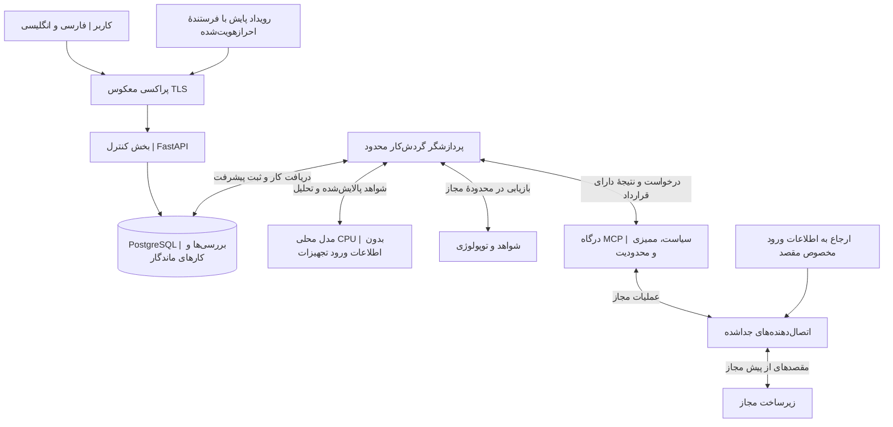
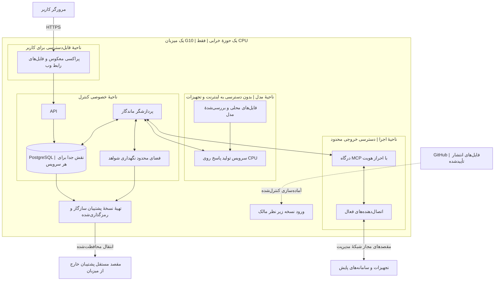
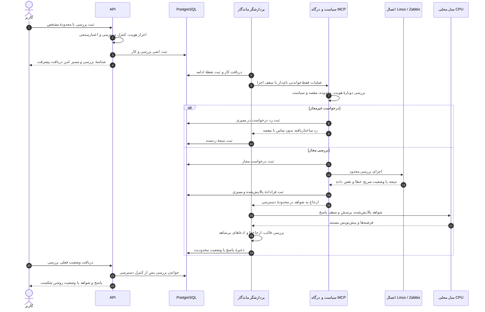
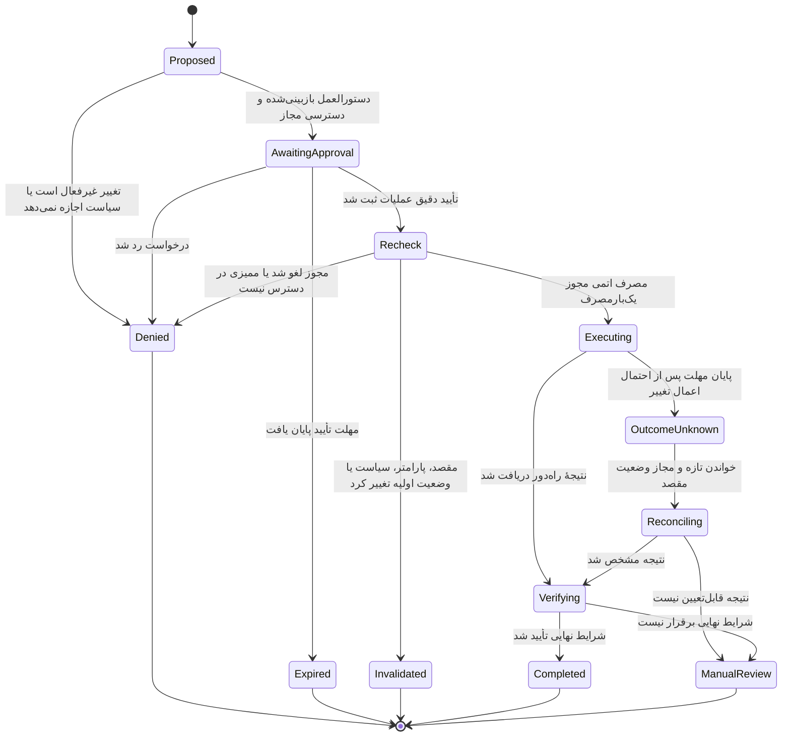
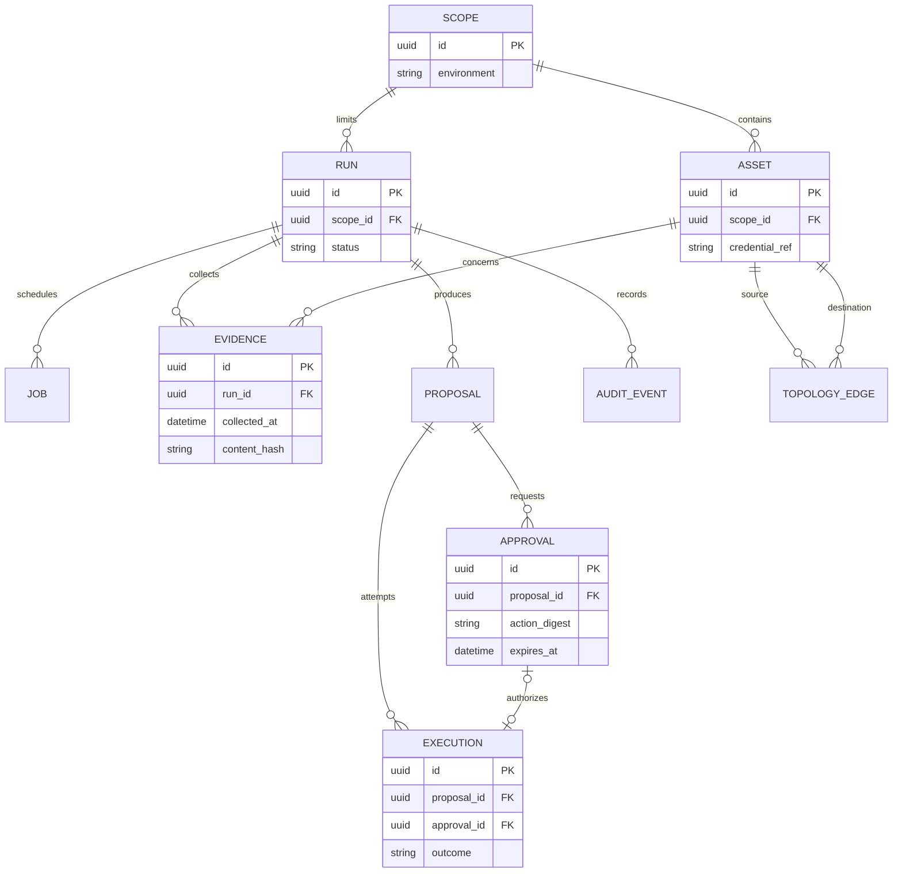
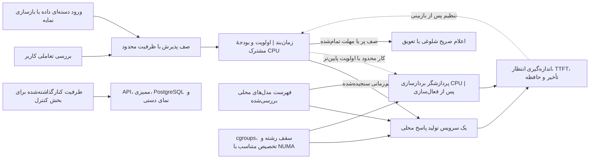
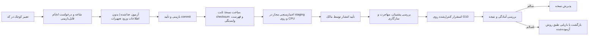

# مجموعهٔ نمودارهای معماری

[English](../en/DIAGRAMS.md) · [فهرست](INDEX.md) · [فناوری‌های پیشنهادی](TECH_STACK.md) · [معماری](ARCHITECTURE.md)

> **طرح پیشنهادی است، نه نمایش یک سامانهٔ مستقر.** این نمودارها بخش‌های ۵، ۷ تا ۱۳، ۱۶، ۱۸ و ۲۰ تا ۲۲ [مشخصات اصلی](../requirements/NEXTOPS_MASTER_PROMPT.md) را توضیح می‌دهند. پرامپت تغییر نکرده است و این مستندات نه مجوز دسترسی به زیرساخت‌اند و نه نشانهٔ وجود سرویس‌های ترسیم‌شده.

هر یک از هفت نمودار به پرسشی متفاوت پاسخ می‌دهد. پیکان‌ها، بسته به برچسب، درخواست، جریان داده یا تغییر وضعیت را نشان می‌دهند؛ نه مجوز دسترسی آزاد در شبکه. خط‌چین به آماده‌سازی کنترل‌شده یا کار اختیاری اشاره دارد، نه وابستگی ابری هنگام اجرا. قرار گرفتن چند جزء در یک کادر به معنای اشتراک اطلاعات ورود نیست.

## ۱. نمای کلی و مرزهای دسترسی

چه کسی با NextOps کار می‌کند و اطلاعات ورود به تجهیزات در اختیار کدام جزء قرار می‌گیرد؟

پردازشگر شواهد را از طریق درگاه می‌گیرد و مستقیماً به تجهیزات متصل نمی‌شود. مدل فقط متن مجاز و پالایش‌شده را دریافت می‌کند. کنترل سیاست در مرز اجرا دوباره انجام می‌شود. هر یازده خانوادهٔ اتصال از همین قرارداد استفاده می‌کنند؛ لازم نیست همه از ابتدا فعال باشند.

## ۲. استقرار روی یک میزبان و ناحیه‌های شبکه

فرایندها کجا اجرا می‌شوند و خرابی سرور G10 چه پیامدی دارد؟

این ناحیه‌ها محدودیت‌های موردنظر را نشان می‌دهند، نه قواعد فایروالِ پیاده‌سازی‌شده. شبکه‌های Compose به‌تنهایی سیاست کامل کنترل ترافیک خروجی نیستند. کاربر فقط به پراکسی معکوس دسترسی دارد و مدیریت میزبان مسیر مجاز جداگانه‌ای می‌خواهد. دریافت یک نسخه از GitHub به معنای اجازهٔ اجرای هر گردش‌کار روی سرور مدیریت نیست. کلیدهای بازیابی نیز به فرایند نگهداری و بازیابی مستقل نیاز دارند. مقصد پشتیبان خارج از میزبان هنوز تعیین نشده است؛ پوشه‌ای دیگر روی G10 جایگزین بازیابی پس از خرابی میزبان نیست.

## ۳. نخستین بررسی فقط‌خواندنی

درخواست کاربر چگونه به پاسخی با ارجاع به شواهد تبدیل می‌شود؟

خواندن مجاز، تأیید تغییر نمی‌خواهد؛ اما کنترل دسترسی و ممیزی حذف نمی‌شوند. شکست اتصال باید آشکار بماند و جای دادهٔ مفقود را اندازه‌گیری ساختگی نگیرد. اگر مدل در دسترس نباشد، بررسی و شواهد جمع‌آوری‌شده همچنان قابل‌مشاهده‌اند؛ درخواست پنهانی به سرویس ابری منتقل نمی‌شود. ارتباط اجزای مختلف با PostgreSQL با نقش‌های محدود و جدا انجام می‌شود، نه با حساب مدیر مشترک.

## ۴. چرخهٔ اقدامات اصلاحی در مراحل آینده

تأیید به کدام عملیات تعلق می‌گیرد و نتیجهٔ نامشخص اجرای راه‌دور چگونه پیگیری می‌شود؟

**تمام مسیرهای تغییردهنده در نسخهٔ اولیه غیرفعال می‌مانند.** تأیید به عمل دقیق، پارامترها، مقصد، درخواست‌کننده، محیط، وضعیت اولیهٔ موردانتظار، نسخهٔ سیاست، زمان انقضا و شناسهٔ یک‌بارمصرف متصل است. نتیجهٔ نامشخص هرگز نباید باعث تکرار کورکورانه شود. لغو کار محلی، توقف عملیات راه‌دور را ثابت نمی‌کند. بازگردانی تغییر یک عملیات جدا با مجوز مستقل است، نه گذار خودکار این نمودار. نمودار فقط زیرگردش‌کار اصلاح را نشان می‌دهد؛ شناسه‌های وضعیت برای هماهنگی با قرارداد فنی انگلیسی مانده‌اند.

## ۵. ارتباط داده‌های اصلی

چه اطلاعاتی باید ماندگار باشند؟ این نمای مفهومی بخشی از مدل است، نه طرح پایگاه دادهٔ پیاده‌سازی‌شده.

برای خواندن مجاز، ارجاع تأیید می‌تواند خالی باشد؛ سیاست برای تغییرات فعال‌شده آن را الزامی می‌کند. تأیید مصرف‌شده نباید اجرای دیگری را مجاز کند؛ یکتایی و گذار اتمی باید در پیاده‌سازی اعمال شوند. کلیدهای خارجیِ حافظ محدودهٔ دسترسی، نقش‌ها، نگهداری داده، ممیزی رخدادهای مدیریتیِ مستقل، قطعات اسناد و ارتباط چندبه‌چند شواهد در طرح کامل [داده و API](DATA_API.md) بررسی می‌شوند. فیلد `credential_ref` فقط ارجاع است، نه رمز عبور. ارتباط تجهیزات باید منبع، تازگی و برچسب مشاهده‌شده یا استنباط‌شده داشته باشد؛ وجود آن در پایگاه داده اتصال زنده را ثابت نمی‌کند. نام موجودیت‌ها و فیلدها عمداً انگلیسی است.

## ۶. پذیرش کار و کنترل منابع CPU

هنگام شلوغی مدل، API چگونه پاسخ‌گو می‌ماند؟

سنجش اولیه با یک درخواست فعال تولید پاسخ آغاز می‌شود و هم‌زمانی فقط پس از اندازه‌گیری افزایش می‌یابد. نمودار عددی برای رشته، هسته یا توکن‌برثانیه تضمین نمی‌کند. پردازش ورودی مدل، تولید پاسخ، بردارسازی، ورود داده، کامپایل و فعالیت پایگاه داده همگی از یک بودجهٔ منابع استفاده می‌کنند. ناهمگام بودن API هزینهٔ پردازش مدل را حذف نمی‌کند. حدود ۹۰ واحد CPU و یک ترابایت RAMِ اعلام‌شده، ظرفیت عملیاتی سامانه را مشخص نمی‌کنند.

## ۷. مسیر انتشار از GitHub تا سرور

چگونه نسخهٔ بازبینی‌شده به سرور می‌رسد، بدون اینکه کد غیرقابل‌اعتماد به زیرساخت دسترسی بگیرد؟

این مسیر سیاست تحویل آینده است، نه گردش‌کار Actionsِ تنظیم‌شده. درخواست‌های ادغام عادی روی runner دائمی و پرمجوز G10 اجرا نمی‌شوند. آزمون سخت‌افزار و تجهیزات آزمایشگاهی جدا و با مجوز روشن انجام می‌شود. بازگشت نسخه باید سازگاری پایگاه داده و مدل را در نظر بگیرد؛ اجرای کانتینر قدیمی، مهاجرت پایگاه داده را معکوس نمی‌کند. انتشار آفلاین نیز از همان معیارهای بررسی، با بستهٔ واردشده، عبور می‌کند.

## ویرایش و نمایش

معنای نمودارهای فارسی و انگلیسی یکسان بماند. شناسه‌ها و فیلدهای پایگاه داده انگلیسی‌اند و توضیح و برچسب کاربری ترجمه می‌شوند. از بلوک‌های استاندارد Mermaid با نوع‌های `flowchart`، `sequenceDiagram`، `stateDiagram-v2` و `erDiagram` استفاده کنید. GitHub نمودار Mermaid را در Markdown نمایش می‌دهد؛ پشتیبانی از نحو به نسخهٔ نمایشگر آن وابسته است. [راهنمای رسمی GitHub](https://docs.github.com/en/get-started/writing-on-github/working-with-advanced-formatting/creating-diagrams) در ۲۰ سپتامبر ۲۰۲۶ بررسی شده است.

این مستندات به میزبان تصویر خارجی، اطلاعات ورود، نشانی واقعی تجهیزات یا سرویس تولید نمودار نیاز ندارند. نمایش نمودار در GitHub بخشی از مستندات است، نه وابستگی اجرای آفلاین NextOps. پس از تغییر، نمای ترسیم‌شده را بررسی کنید؛ کنترل متن و پیوند جای آزمون نمایش Mermaid را نمی‌گیرد. حدود اعتبارسنجی این تغییر در [گزارش بازبینی](../VISUAL_REVIEW.md) آمده است.

