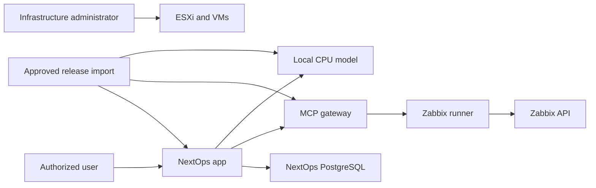

# NextOps threat model

Status: Phase 0 proposal, pending owner acceptance and implementation evidence. Updated: 2026-09-20.

## Executive summary

NextOps is currently a documentation-only repository, so every runtime control below is proposed rather than implemented. The highest-risk future boundaries are local identity and scope enforcement, isolation of the Zabbix credential inside the connector runner, prevention of target substitution and prompt injection, integrity of offline release/model bundles, and durable audit behavior. The initial deployment is one organization on an internal LAN/VPN with no intended public ingress, but its infrastructure evidence and credentials are sensitive. A future multi-organization mode must not reuse the initial single-organization authorization assumptions without a separate isolation design and test gate.

## Scope and assumptions

- In scope: the planned application, worker, PostgreSQL, local CPU inference, MCP gateway, isolated Zabbix runner, dedicated Zabbix server, offline release path, and their deployment on the existing ESXi host.
- Repository scope: all tracked files, with primary anchors in `docs/requirements/NEXTOPS_MASTER_PROMPT.md`, `docs/en/ARCHITECTURE.md`, `docs/en/SECURITY.md`, `docs/en/ZABBIX_SERVER.md`, `docs/en/OFFLINE_RUNTIME.md`, and `docs/en/SERVER_PLAN.md`.
- The owner confirmed one organization initially, internal growth later, a small initial workload, and the dedicated `zabbix-server` path.
- Assumption: intended user ingress is restricted to an approved internal LAN or VPN. Public Internet ingress is out of scope unless separately designed and approved.
- Assumption: Phase 1 has no infrastructure mutation capability. Read-only requests still require authentication, authorization, budgets, evidence scoping, and audit.
- Current implementation reality: there are no application entrypoints, dependency manifests, migrations, deployment definitions, CI workflows, or executable connector implementations in the repository.

Open questions that affect risk ranking:

- Exact user count, concurrent investigation target, monitored estate size, event rate, and evidence-retention volume.
- Local identity bootstrap/recovery mechanism, optional LAN identity-provider relationship, and certificate/time source.
- Final network segments, firewall rules, Zabbix host-group scope, secret-store mechanism, and off-host backup destination.
- Conditions and tenant-isolation model for the future move beyond one organization.

## System model

### Primary components

- `nextops-app`: proposed reverse-proxied UI/API, local identity, deterministic policy calls, durable request orchestration, evidence display, and audit initiation.
- PostgreSQL in `nextops-app`: proposed initial authoritative store with separate service roles for application state, durable jobs, evidence metadata, and append-restricted audit.
- `nextops-ai`: proposed authenticated internal CPU-only inference service using verified local artifacts and no device credentials.
- `nextops-connectors-ro`: proposed protected MCP gateway plus a distinct, isolated Zabbix runner. Only the runner receives the scoped Zabbix token.
- `zabbix-server`: proposed dedicated monitoring VM with its own PostgreSQL and frontend/API. It is not the NextOps database or inference host.
- Release/provisioning path: approved GitHub release or offline bundle imported before runtime, with versions, licenses, checksums, and no production credentials.
- ESXi administration: a separate operator-controlled management plane. NextOps is never installed in the ESXi management shell.

### Data flows and trust boundaries

- Authorized browser/CLI -> `nextops-app`: questions, sessions, and scope over certificate-verified HTTPS. Proposed controls are local authentication, revocation, CSRF/origin protections where applicable, request schemas, rate limits, and bounded payloads.
- `nextops-app` -> PostgreSQL: users, scopes, runs, workflow state, evidence references, and audit over a private service channel. Proposed controls are separate least-privilege roles, migrations, constraints, transaction boundaries, and no shared superuser.
- `nextops-app` -> MCP gateway: typed named diagnostic requests over authenticated internal transport. Proposed controls are service authentication, policy versioning, target allowlists, deadlines, budgets, and audit availability.
- MCP gateway -> Zabbix runner: validated operation/target arguments over a private process or service boundary. The runner rechecks allowlisted methods and target scope and rejects direct unauthenticated calls.
- Zabbix runner -> `zabbix-server`: scoped JSON-RPC reads over certificate-verified HTTPS. The dedicated token is limited by both Zabbix role/host-group permissions and the gateway allowlist.
- `nextops-app` -> `nextops-ai`: sanitized evidence and bounded generation requests over authenticated internal transport. Credentials and management-network routes are absent from the model boundary.
- `nextops-ai` -> `nextops-app`: schema-validated explanatory output. Model output is untrusted and cannot authorize tools, change policy, or supply deterministic counts.
- Release workstation/GitHub -> runtime VMs: signed or checksum-verified release/model artifacts during provisioning only. Runtime startup, login, inference, and health do not contact GitHub or package/model registries.
- Infrastructure administrator -> ESXi/VMs: provisioning, network, storage, recovery, and secret placement through an approved management path outside the model and user-request path.

#### Diagram

## Assets and security objectives

| Asset | Why it matters | Security objective (C/I/A) |
|---|---|---|
| Zabbix API token and future connector credentials | Enables access to infrastructure evidence and could expand blast radius if over-scoped | C/I |
| User identities, roles, sessions, and scopes | Determine who can see evidence and initiate work | C/I/A |
| Policy registry and tool schemas | Define permitted operations, targets, limits, and risk classes | I/A |
| Durable requests and workflow state | Prevent duplicate work, lost status, and unsafe retry behavior | I/A |
| Evidence and provenance | Answers are trustworthy only when scope, freshness, and source remain intact | C/I/A |
| Security audit | Required to reconstruct access and policy decisions and detect abuse | I/A |
| Model, tokenizer, templates, and runtime binaries | Tampering could alter outputs or introduce code execution/data exfiltration | C/I/A |
| Release and offline bundles | Compromise can affect every runtime service without an online repair path | I/A |
| PostgreSQL data and backup/recovery material | Contains identities, state, evidence metadata, and recovery-critical information | C/I/A |
| Host CPU, RAM, and storage | Exhaustion can remove diagnostics, audit, or monitoring on the single host | A |

## Attacker model

### Capabilities

- A user with valid but limited credentials can submit Persian, English, mixed-language, and intentionally adversarial questions.
- A compromised or malicious monitored host can place prompt-injection text and misleading values into host names, event fields, logs, or item values returned by Zabbix.
- A network attacker with access to an internal segment may attempt service discovery, replay, target substitution, TLS downgrade, denial of service, or credential theft.
- A malicious or compromised contributor may alter dependencies, CI configuration, release scripts, model manifests, or documentation commands.
- A service or host administrator may have broad technical control; same-host audit/checkpoints cannot fully resist that administrator.

### Non-capabilities

- The initial design does not expose a public Internet endpoint and does not enable anonymous users.
- Phase 1 contains no approved mutation tool, arbitrary shell, arbitrary SQL, Zabbix acknowledgement, remote script, or configuration-change path.
- The model has no infrastructure credentials, direct management-LAN route, or authority to grant permissions.
- Cross-organization attacks are not initially reachable because only one organization is deployed; they become in scope before any multi-organization expansion.

## Entry points and attack surfaces

| Surface | How reached | Trust boundary | Notes | Evidence (repo path / symbol) |
|---|---|---|---|---|
| Web/API question submission | Internal browser or CLI | User -> app | Planned authenticated, versioned, bounded requests | `docs/requirements/NEXTOPS_MASTER_PROMPT.md` sections 17 and 26 |
| Session and recovery endpoints | Internal browser/admin path | User/admin -> identity | Bootstrap and recovery design remains open | `docs/en/OFFLINE_RUNTIME.md` sections 2 and 4 |
| MCP gateway | Internal app call | App -> execution boundary | Must not accept browser/model/direct unauthenticated calls | `docs/en/MCP.md`; `docs/adr/0003-security-before-execution.md` |
| Zabbix runner | Gateway call and Zabbix response | Gateway -> runner -> Zabbix | Token and target scope are the highest-value connector boundary | `docs/en/ZABBIX_SERVER.md` sections 5 and 6 |
| Model inference API | Internal app call | App -> model | Output is untrusted; input must exclude secrets | `docs/adr/0002-local-cpu-only.md`; `docs/en/CPU_AI.md` |
| Zabbix evidence fields | API response | Managed estate -> connector/app/model | Host/event text can contain prompt injection or spoofed identifiers | `docs/requirements/NEXTOPS_MASTER_PROMPT.md` section 14 |
| PostgreSQL roles and migrations | Internal services and release process | Service/release -> database | No implementation exists; role separation and migration serialization are required | `docs/adr/0004-postgresql-first.md` |
| Offline bundle/import | Operator-controlled import | Provisioning -> runtime | Integrity, provenance, license, and completeness are release gates | `docs/en/OFFLINE_RUNTIME.md` sections 4 and 5 |
| ESXi/guest administration | Restricted admin path | Operator -> host/VM | Separate from runtime; recovery path and permissions are unresolved | `docs/en/ESXI_BASELINE.md`; `AGENTS.md` |

## Top abuse paths

1. A limited user crafts or replays a request with another target identifier -> missing object-level authorization exposes out-of-scope Zabbix evidence -> infrastructure confidentiality is lost.
2. A monitored host injects instructions into an event name -> the model treats evidence as authority -> it requests broader tools or leaks sensitive context -> policy boundaries are bypassed unless deterministic checks reject the request.
3. An attacker reaches the connector service directly -> supplies an allowlisted-looking method with a substituted destination -> the runner becomes an SSRF or management-network proxy -> unauthorized systems are queried.
4. A broadly scoped Zabbix token is copied from environment, logs, errors, or a shared service account -> attacker reads more host groups than intended -> monitored-estate data is exposed.
5. Audit storage fails while the diagnostic path continues -> access and policy decisions become untraceable -> abuse and data leakage cannot be reconstructed.
6. Repeated long prompts or oversized evidence sets saturate CPU/RAM/queue storage -> local inference blocks login, audit, or monitoring on the same host -> operational availability is lost.
7. A modified model/runtime/container is inserted into an offline bundle -> startup executes unreviewed code or changes model behavior -> credentials/evidence may be exposed or answers corrupted.
8. Stale or partial Zabbix results are presented without freshness/coverage markers -> the user treats an incomplete answer as current truth -> an operational decision causes avoidable outage or delayed response.
9. The organization expands without adding organization keys and authorization tests -> cached queries or joins cross scopes -> one organization can see another's assets or incidents.
10. The single ESXi host or DS-C fails -> NextOps, Zabbix, audit, and same-host backups fail together -> diagnostics and monitoring become unavailable without independent recovery.

## Threat model table

| Threat ID | Threat source | Prerequisites | Threat action | Impact | Impacted assets | Existing controls (evidence) | Gaps | Recommended mitigations | Detection ideas | Likelihood | Impact severity | Priority |
|---|---|---|---|---|---|---|---|---|---|---|---|---|
| TM-001 | Authenticated limited user | Valid session and an object ID outside the user's scope | Manipulates target/scope fields or replays another run | Unauthorized evidence disclosure or work initiation | Identity, scopes, evidence, audit | Deny-by-default scoped policy is required in `docs/en/SECURITY.md` and ADR 0003 | No code, schema, or object-level authorization test exists | Put organization/environment/target scope in every permission-sensitive key; authorize before collection and before evidence retrieval; add cross-scope tests | Audit denied target IDs and repeated scope mismatches without logging sensitive payloads | Medium | High | High |
| TM-002 | Compromised monitored asset or malicious user | Attacker controls Zabbix text or question content | Embeds instructions that the model treats as trusted control text | Tool misuse, data leakage, or unsupported claims | Policy, evidence, credentials, answer integrity | External content is explicitly untrusted in the active prompt section 14 | No implemented evidence labeling, schema boundary, or output validator | Separate trusted instructions from evidence, cap and label fields, allow only named tools, validate model output schemas, enforce policy independently | Record rejected tool proposals, schema failures, and injection test results | High | High | High |
| TM-003 | Internal attacker or compromised service | Access to process environment, logs, image, or connector endpoint | Steals or reuses the Zabbix token or bypasses the gateway | Broad monitoring-data exposure | Connector credentials, Zabbix evidence | Token isolation and gateway/runner separation are required by `docs/en/ZABBIX_SERVER.md` section 5 | Secret mechanism, rotation, endpoint authentication, and filesystem permissions are undecided | Deliver token only to runner through protected reference; use separate service identities, mTLS or equivalent internal auth, short expiry/rotation, and no direct listener where unnecessary | Alert on token failures, unexpected source identities, methods, targets, and host groups | Medium | High | High |
| TM-004 | Internal network attacker or compromised app | Ability to influence URL, target, redirect, DNS, or inventory mapping | Redirects a connector request to an unapproved internal destination | SSRF, lateral discovery, or credential forwarding | Network boundary, credentials, managed assets | Destination allowlists and TLS validation are required in `docs/en/MCP.md` | Concrete inventory normalization and redirect/DNS rules are not implemented | Resolve stable asset IDs to administrator-owned endpoints; validate scheme/host/port and resolved addresses; disable arbitrary redirects; never accept a raw URL from the model | Log normalized destination IDs, resolution changes, and denied redirects | Medium | High | High |
| TM-005 | Service failure or privileged operator | Audit/database unavailable or bypass route exists | Executes or serves evidence without durable policy/audit record | Loss of accountability and hidden abuse | Audit, workflow state, evidence access | Required audit failure behavior is documented in active prompt sections 13 and 20 | Append restrictions, roles, failure semantics, and external checkpoints are not implemented | Fail closed for required diagnostic audit; separate audit role/table/partition; queue no unverifiable success; add protected external checkpoints later | Alert on write failures, sequence gaps, clock anomalies, and unlogged result paths | Medium | High | High |
| TM-006 | Authenticated user, malformed evidence, or runaway worker | No effective token/row/queue/concurrency budgets | Saturates inference, database, disk, or connector capacity | Login, audit, and diagnostics become unavailable | Host resources, jobs, audit, Zabbix | Resource caps and one-active-request start are proposed in active prompt sections 9-10 | No measured limits or enforced admission control exists | Bound prompt/output/evidence bytes, queue length, fan-out, tool/LLM calls, database queries, and worker concurrency; reserve control-plane capacity | Measure queue age, TTFT, memory pressure, CPU ready/co-stop, disk growth, and rejection counts | High | Medium | High |
| TM-007 | Compromised contributor, registry, or provisioning workstation | Ability to alter a release/model artifact before import | Supplies tampered code, image, model, template, or dependency | Code execution, evidence exfiltration, or answer corruption across all services | Release bundle, runtime, model, credentials | Checksums, pinned artifacts, and offline import are required by `docs/en/OFFLINE_RUNTIME.md` | No CI, signing, SBOM, lockfiles, or bundle verifier exists | Pin dependencies and Actions; generate SBOM/model manifests; sign release metadata; verify checksums/licenses offline before promotion; keep credentials out of bundle | Record bundle identity and verification result; alert on mismatch or unexpected outbound request | Medium | High | High |
| TM-008 | Hardware failure, storage failure, or host administrator error | All services and local backups share the G10 failure domain | Host/DS-C outage removes monitoring, answers, and recovery copies | Extended loss of monitoring and diagnostic service | Availability, database, audit, models | Single-host limitation is explicit in ADR 0001 and `docs/en/ZABBIX_SERVER.md` section 8 | Off-host backup target, RPO/RTO, and independent outage detection are undecided | Select encrypted off-host or controlled offline-media backup; test isolated restore; define recovery access and measured RPO/RTO | Track backup age, restore-test age, independent heartbeat, and DS-C health | Medium | High | High |
| TM-009 | Connector failure, stale item, permission gap, or model error | Partial or old evidence is returned without complete metadata | Presents missing or stale results as current healthy status | Incorrect operational decision | Evidence provenance and answer integrity | Freshness/scope/source requirements are defined in `docs/en/SERVER_PLAN.md` and ZBX-02/ZBX-05 | No deterministic aggregator or answer schema exists | Store collection and measurement times, partial flags, filters, and scope; compute counts in code; require explicit unknown/stale states | Compare answer facts to captured API fixtures; monitor stale/partial response rates | High | Medium | High |
| TM-010 | Future organization member or implementation error | Multi-organization expansion occurs without redesigned isolation | Reuses single-org caches, identifiers, roles, or database queries | Cross-organization evidence disclosure | Identities, assets, incidents, evidence, audit | Initial one-organization scope is explicit and organization keys are proposed | No multi-organization contract or isolation suite exists | Treat expansion as a migration with organization-scoped keys/FKs/cache keys, backfill validation, admin boundaries, and adversarial tests before onboarding a second organization | Alert on mismatched organization IDs and forbidden joins; run isolation probes | Low now; rises with expansion | High | Medium now |

## Criticality calibration

- Critical: a reachable unauthenticated path to connector credentials or remote code execution; a policy bypass that enables infrastructure mutation; or systematic cross-organization disclosure after expansion. No such implemented path exists today because there is no runtime code.
- High: theft of a read-only monitoring credential, object-scope bypass, connector SSRF into the management network, compromised offline release, or loss of both service and recoverable state on the single host.
- Medium: bounded authenticated denial of service, stale-evidence misclassification with visible provenance gaps, or a future multi-organization weakness before a second organization is actually onboarded.
- Low: low-sensitivity version disclosure, a noisy rejected request, or a failure requiring an already trusted host administrator where no additional privilege or durable concealment is gained.

Ranking depends most on the internal-only ingress assumption, final Zabbix token scope, identity/recovery design, off-host backup choice, and whether a second organization is introduced.

## Focus paths for security review

| Path | Why it matters | Related Threat IDs |
|---|---|---|
| `docs/requirements/NEXTOPS_MASTER_PROMPT.md` | Canonical safety, workflow, deployment, and acceptance invariants | TM-001–TM-010 |
| `docs/en/SECURITY.md` | Proposed identity, secrets, policy, approvals, and audit controls | TM-001–TM-005 |
| `docs/en/MCP.md` | Gateway, tool schema, destination, and execution-boundary contract | TM-002–TM-005 |
| `docs/en/ZABBIX_SERVER.md` | Token scope, API method allowlist, evidence semantics, and dedicated VM boundary | TM-002–TM-004, TM-009 |
| `docs/en/OFFLINE_RUNTIME.md` | Bundle integrity, hidden dependencies, local identity, and outage tests | TM-006–TM-008 |
| `docs/en/DATA_API.md` | Planned permission-sensitive records, durable workflow, evidence, and audit | TM-001, TM-005, TM-009, TM-010 |
| `docs/en/SERVER_PLAN.md` | Zabbix status semantics and ZBX acceptance cases | TM-006, TM-008, TM-009 |
| `docs/en/ARCHITECTURE.md` | Planned service/module ownership and inward dependency boundaries | TM-001–TM-007 |
| `docs/en/DIAGRAMS.md` | Proposed deployment, sequence, approval, data, CPU, and release flows | TM-001–TM-010 |
| `docs/STORAGE_PLAN.md` | Capacity, low-space behavior, snapshots, and recovery workspace | TM-006, TM-008 |
| `.github/` | Current review metadata and future CI/release trust boundary | TM-007 |
| `scripts/check_docs.py` | The only executable project file; currently documentation-only and network-free | TM-007 |

## Notes on use

- All runtime controls are design requirements, not verified implementations.
- All discovered planned entry points and trust boundaries are represented above; current executable scope is limited to the network-free documentation checker.
- Runtime services are separated from GitHub/CI/provisioning and from ESXi administration.
- Owner clarification is reflected: one organization now, small initial scale with growth expected, and a dedicated Zabbix server.
- Revisit this model before public exposure, infrastructure mutations, onboarding a second organization, or changing the connector/network boundary.
